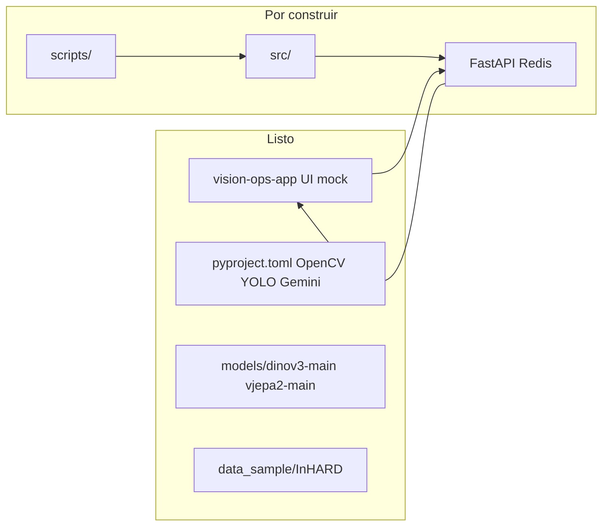
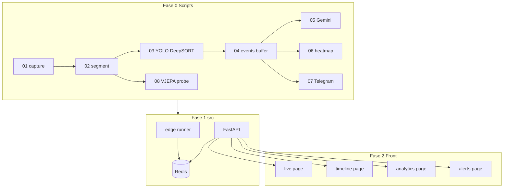

# Plan de fases VisionOps (scripts → src → front)

## Síntesis de requisitos (PRD + alineación)


| Fuente                                                                                                                  | Contenido clave                                                                                                                    |
| ----------------------------------------------------------------------------------------------------------------------- | ---------------------------------------------------------------------------------------------------------------------------------- |
| [PRD.pdf](Equipo56/Project/PRD.pdf)                                                                                     | Edge: RTSP/ONVIF + OpenCV, YOLOv8 + DeepSORT, Redis; Cloud: Gemini/GPT-4V, heatmaps Plotly; 4 pantallas (REQ-01 a REQ-04); JWT/TLS |
| [Alineación](Equipo56/Project/Alineación_del_Proyecto_Integrador_Team_2_FirmadoXLandyXFernandoXCarlos_signed%20(1).pdf) | FastAPI + Redis, edge + nube, Telegram, CRISP-DM, gemelo digital                                                                   |
| [README raíz](README.md)                                                                                                | Línea I+D: DINOv3 + V-JEPA + NLP (después del MVP PRD)                                                                             |


**Decisión de stack (confirmada):** Fase 0 prioriza **YOLOv8 + DeepSORT** para live/tracking; scripts de **V-JEPA/DINOv3** entran como sub-fase 0.6+ sobre clips (InHARD / video de prueba), sin bloquear el MVP.

## Estado actual del repo




- **Front:** [vision-ops-app](vision-ops-app) — Next.js 16, 4 rutas (`/live`, `/timeline`, `/analytics`, `/alerts`) con datos en [lib/mock-data.ts](vision-ops-app/lib/mock-data.ts). Componentes clave: `CameraFeedCard`, `RealtimeEventsPanel`.
- **Back:** [src/](src/) vacío.
- **Scripts:** carpeta `scripts/` no existe aún.
- **Deps Python:** [pyproject.toml](pyproject.toml) ya incluye OpenCV, Ultralytics, DeepSORT, Gemini, Plotly; **faltan** `fastapi`, `uvicorn`, `redis`, `pydantic-settings` (añadir en Fase 1).

---

## Fase 0 — Scripts atómicos (`scripts/`)

Objetivo: validar cada eslabón del pipeline de forma **ejecutable, aislada y con salida en disco/JSON** antes de empaquetar en `src/`.

Convenciones propuestas:

```text
scripts/
├── README.md                 # orden de ejecución, variables de entorno
├── _common/                  # paths, logging, argparse helpers
│   └── io.py
├── 01_capture_stream.py      # webcam / archivo / RTSP
├── 02_segment_frames.py      # frames + clips temporales
├── 03_detect_and_track.py    # YOLOv8 + DeepSORT
├── 04_build_event_buffer.py  # JSON local (simula Redis)
├── 05_semantic_event.py      # Gemini sobre clip + coords
├── 06_generate_heatmap.py    # coordenadas → PNG/JSON grid
├── 07_telegram_webhook.py    # alerta de prueba
└── 08_vjepa_action_probe.py  # opcional post-MVP PRD
```

### 0.1 — Ingesta (`01_capture_stream.py`)

- Abrir fuente: índice webcam (`0`), path `.mp4`, o URL RTSP (`cv2.VideoCapture`).
- Flags: `--source`, `--max-frames`, `--fps-sample`, `--out-dir`.
- Salida: `outputs/01_capture/frame_%06d.jpg` + `metadata.json` (resolución, fps, timestamps).
- Criterio de éxito: 30+ frames guardados sin pérdida de lectura.

### 0.2 — Segmentación (`02_segment_frames.py`)

- Entrada: video o carpeta de frames de 0.1.
- Generar:
  - **frames espaciados** (p. ej. 1 fps para DINO/YOLO estático).
  - **clips** de N frames / T segundos (p. ej. 16–64 frames @ ~8–30 fps) para acciones.
- Salida: `outputs/02_segments/clips/clip_0001/` + `manifest.json` (start_sec, end_sec, parent_video).

**Datos de prueba:** clips en [data_sample/InHARD-master/01-InHARD/Segmented/](data_sample/InHARD-master/01-InHARD/Segmented/) para no depender de cámara en laboratorio.

### 0.3 — Detección + tracking (`03_detect_and_track.py`)

- YOLOv8 (clases COCO adaptables: person, vehicle) + DeepSORT (`deep-sort-realtime`).
- Por frame: lista `{track_id, class, bbox, confidence}`.
- Dibujar overlay → `outputs/03_track/annotated.mp4` o frames anotados.
- Criterio: IDs estables en secuencia corta (mismo operador/montacargas).

### 0.4 — Buffer de eventos (`04_build_event_buffer.py`)

- Consumir salida de 0.3; reglas simples MVP:
  - persona en zona ROI → `warning`
  - track detenido > X s → `idle`
  - clase forklift + velocidad proxy → `forklift_zone`
- Persistir en `events.jsonl` (simula cola Redis).
- Opcional: si Redis local disponible (`docker run redis`), script dual `--backend json|redis`.

### 0.5 — Semántica cloud (`05_semantic_event.py`)

- Tomar clip + resumen de coordenadas del evento.
- Llamar Gemini (`google-generativeai`, key en `.env`).
- Salida: texto estilo bitácora PRD (*"Operador 3 inactivo 14 min..."*) + JSON estructurado `{title, severity, description, zone}`.

### 0.6 — Heatmap (`06_generate_heatmap.py`)

- Agregar centroides de tracks por zona del plano (grid configurable o imagen de planta placeholder).
- Exportar PNG + JSON para el módulo Analytics (REQ-03).

### 0.7 — Alertas (`07_telegram_webhook.py`)

- POST a webhook Telegram con thumbnail del evento (REQ-04).
- Reutilizar payload de 0.4/0.5.

### 0.8 — Acciones con modelos (post-YOLO, no bloqueante)

- `08_vjepa_action_probe.py`: wrapper mínimo sobre [models/vjepa2-main/notebooks/vjepa2_demo.py](models/vjepa2-main/notebooks/vjepa2_demo.py) — clip InHARD → embedding → clasificación probe (cuando existan pesos locales, excluidos de git).
- Script hermano futuro `08b_dinov3_scene.py` para features espaciales por frame.
- **No sustituye** YOLO en live; alimenta timeline post-turno y experimentación CRISP-DM.

### Entregable Fase 0

- `scripts/README.md` con pipeline: `01 → 02 → 03 → 04 → (05|06|07)`.
- Carpeta `outputs/` en `.gitignore`.
- Evidencia: un run completo sobre 1 clip InHARD + 1 prueba webcam/RTSP.

---

## Fase 1 — Código fuente backend (`src/`)

Objetivo: **refactorizar** la lógica probada en scripts hacia módulos importables y exponer API.

### Estructura propuesta

```text
src/
├── vision_ops/
│   ├── ingestion/       # StreamReader, RTSP config
│   ├── segmentation/    # FrameSampler, ClipBuilder
│   ├── detection/       # YoloDetector
│   ├── tracking/        # DeepSortTracker
│   ├── events/          # EventBuffer, rules engine
│   ├── cloud/           # SemanticClient (Gemini)
│   ├── analytics/       # HeatmapBuilder
│   └── alerts/          # TelegramNotifier
├── api/
│   ├── main.py          # FastAPI app
│   ├── deps.py
│   ├── auth.py          # JWT (MVP: API key → JWT)
│   └── routers/
│       ├── cameras.py   # REQ-01
│       ├── events.py    # live + timeline REQ-02
│       ├── analytics.py # REQ-03
│       └── alerts.py    # REQ-04
└── edge/
    └── runner.py        # loop: ingest → detect → buffer
```

### Migración desde scripts


| Script | Módulo `src/`                         |
| ------ | ------------------------------------- |
| 01     | `vision_ops.ingestion`                |
| 02     | `vision_ops.segmentation`             |
| 03     | `vision_ops.detection` + `tracking`   |
| 04     | `vision_ops.events` + adaptador Redis |
| 05     | `vision_ops.cloud`                    |
| 06     | `vision_ops.analytics`                |
| 07     | `vision_ops.alerts`                   |


### API mínima (contrato para el front)


| Endpoint                                            | REQ                  | Respuesta alineada con mock       |
| --------------------------------------------------- | -------------------- | --------------------------------- |
| `GET /api/cameras`                                  | REQ-01               | lista `CameraFeed`                |
| `GET /api/cameras/{id}/stream` o WS `/ws/live/{id}` | REQ-01               | MJPEG/WebSocket frames + overlays |
| `GET /api/events/live`                              | REQ-01 panel lateral | `RealtimeEvent[]`                 |
| `GET /api/timeline`                                 | REQ-02               | filtros `?from&to&severity&zone`  |
| `GET /api/timeline/{id}/clip`                       | REQ-02               | URL/blob del clip                 |
| `GET /api/analytics/heatmap`                        | REQ-03               | grid + metadata rango fechas      |
| `GET/POST /api/alerts/rules`                        | REQ-04               | CRUD reglas                       |
| `POST /api/alerts/test`                             | REQ-04               | dispara Telegram                  |


### Infra local Fase 1

- Añadir a `pyproject.toml`: `fastapi`, `uvicorn[standard]`, `redis`, `pydantic-settings`, `python-multipart`, `httpx`.
- `docker-compose.yml` (raíz): servicios `redis`, opcional `api`.
- Variables: `.env.example` (`GEMINI_API_KEY`, `TELEGRAM_BOT_TOKEN`, `REDIS_URL`, `JWT_SECRET`).

### Entregable Fase 1

- `uv run uvicorn api.main:app --reload` sirve contratos anteriores.
- `edge/runner.py` procesa al menos 1 cámara/archivo y llena Redis/JSON.
- Tests unitarios en `tests/` para: segmentación, reglas de eventos, serializers API.

---

## Fase 2 — Integración front ([vision-ops-app](vision-ops-app))

Objetivo: sustituir mocks por API real **pantalla por pantalla**, manteniendo tipos existentes.

### 2.1 Capa de datos

- Crear [vision-ops-app/lib/api.ts](vision-ops-app/lib/api.ts) — `fetch`/`SWR` hacia `NEXT_PUBLIC_API_URL`.
- Mapear respuestas backend → tipos de [mock-data.ts](vision-ops-app/lib/mock-data.ts) (misma forma `CameraFeed`, `TimelineEvent`, etc.).
- Feature flag: `USE_MOCK_DATA=true` para demos sin backend.

### 2.2 Por pantalla (orden sugerido)


| Pantalla         | Archivo                                                                 | Integración                                               |
| ---------------- | ----------------------------------------------------------------------- | --------------------------------------------------------- |
| REQ-01 Live      | [live/page.tsx](vision-ops-app/app/(dashboard)/live/page.tsx)           | streams reales o snapshot polling; overlays desde API     |
| REQ-02 Timeline  | [timeline/page.tsx](vision-ops-app/app/(dashboard)/timeline/page.tsx)   | filtros wired; reproductor clip `/api/timeline/{id}/clip` |
| REQ-04 Alerts    | [alerts/page.tsx](vision-ops-app/app/(dashboard)/alerts/page.tsx)       | CRUD reglas + toggle                                      |
| REQ-03 Analytics | [analytics/page.tsx](vision-ops-app/app/(dashboard)/analytics/page.tsx) | heatmap desde PNG/JSON API; gráficas KPI                  |


### 2.3 Auth y CORS

- Middleware Next o header `Authorization` desde login simple (JWT del backend).
- FastAPI `CORSMiddleware` para `localhost:3000`.

### Entregable Fase 2

- Demo end-to-end: edge runner → API → UI live + timeline con datos reales de una sesión de prueba.

---

## Fase 3 — Cloud post-turno y NFR

- Job batch (cron/`POST /api/shifts/{id}/close`): re-procesar clips del turno con 0.5 + 0.8 (semántica + acciones).
- Indexación de eventos para búsqueda (SQLite/Postgres ligero o solo JSON indexado en MVP académico).
- NFR PRD: JWT obligatorio en rutas, TLS en despliegue, healthcheck `GET /health`, telemetría básica (latencia Redis, fps edge).
- PyInstaller del paquete `edge/` — fase tardía, no bloquear integración UI.

---

## Fase 4 — Endurecimiento y despliegue

- Docker multi-stage: `api`, `edge`, `vision-ops-app`.
- Documentar runbook en `Equipo56/Project/` (evidencia CRISP-DM Deployment/Monitoring).
- Métricas: precisión YOLO en escena planta, F1 acciones en InHARD (script eval separado).

---

## Diagrama de pipeline completo




---

## Roles sugeridos (equipo de 3)


| Fase | ML/Datos                 | Backend/MLOps               | Producto/UX              |
| ---- | ------------------------ | --------------------------- | ------------------------ |
| 0    | scripts 02, 03, 08       | scripts 01, 04, 07          | validar salidas vs REQ   |
| 1    | módulos detection/events | FastAPI, Redis, edge runner | contratos API + tipos TS |
| 2    | heatmap/analytics        | CORS, auth, WS stream       | wiring páginas Next      |
| 3–4  | eval + V-JEPA            | deploy, monitoring          | demo sponsor             |


---

## Riesgos y mitigaciones


| Riesgo                            | Mitigación                                                  |
| --------------------------------- | ----------------------------------------------------------- |
| RTSP inestable en dev             | Probar con InHARD + archivo local en 01                     |
| Pesos V-JEPA no en repo           | Fase 0.8 opcional; documentar descarga en `scripts/README`  |
| Gap PRD (YOLO) vs README (V-JEPA) | YOLO en live; V-JEPA solo post-turno hasta validar latencia |
| `src/` vacío                      | No escribir API hasta que script 03–04 pasen en una sesión  |


---

## Criterios de “listo” por fase

- **Fase 0:** pipeline documentado ejecutable sin importar `src/`; artefactos en `outputs/`.
- **Fase 1:** mismos resultados vía `uv run python -m edge.runner` + endpoints REST probados con `curl`/pytest.
- **Fase 2:** `USE_MOCK_DATA=false` muestra datos reales en Live y Timeline.
- **Fase 3–4:** bitácora post-turno generada + alerta Telegram en evento simulado.

