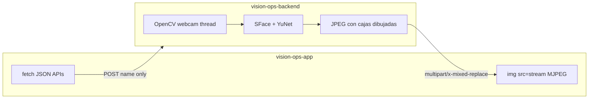
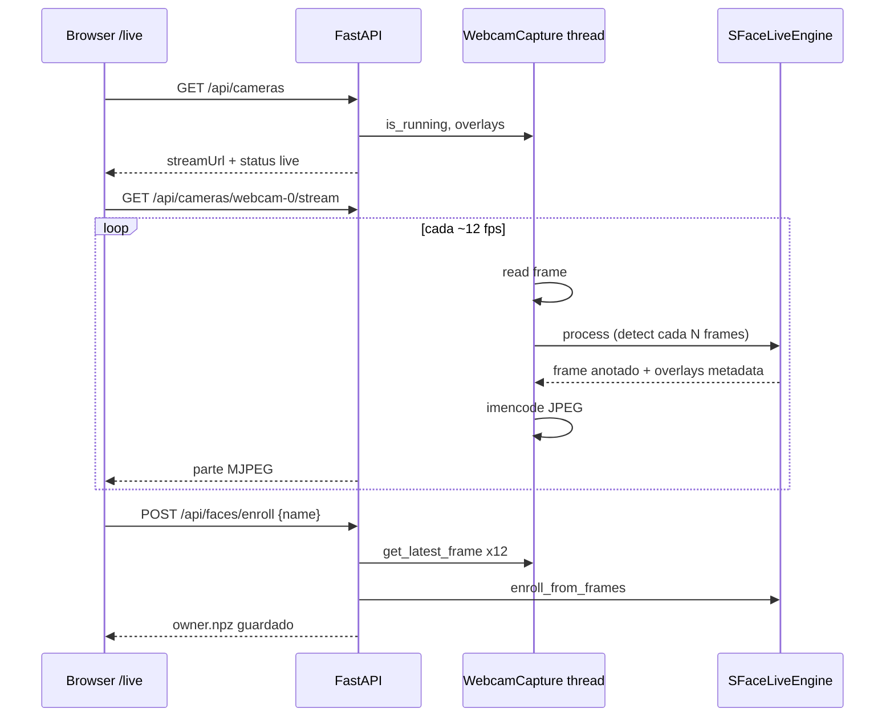
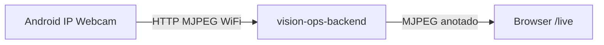
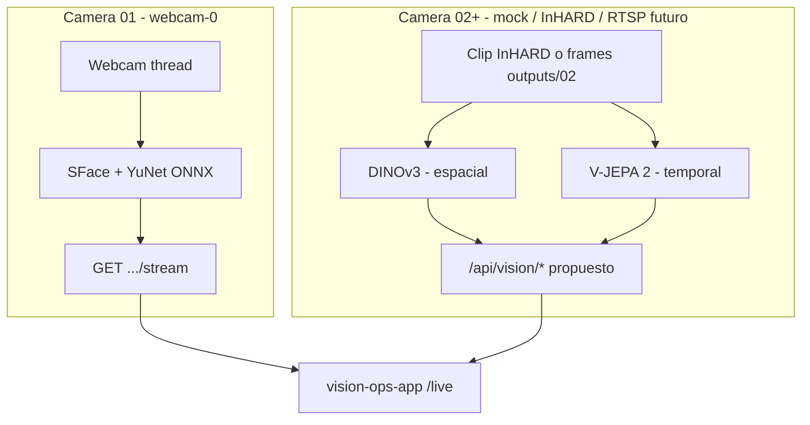
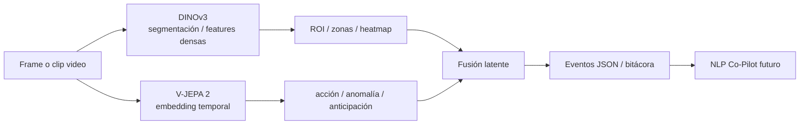
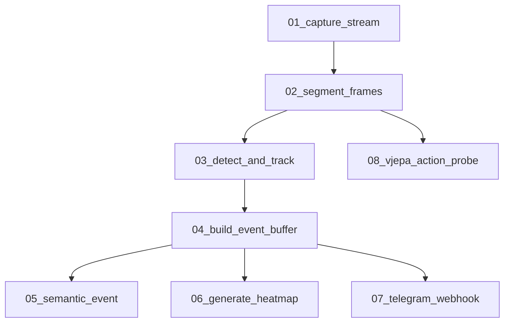
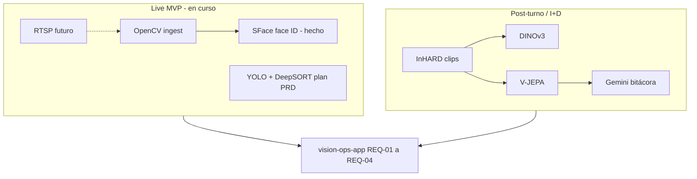
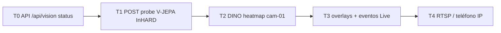
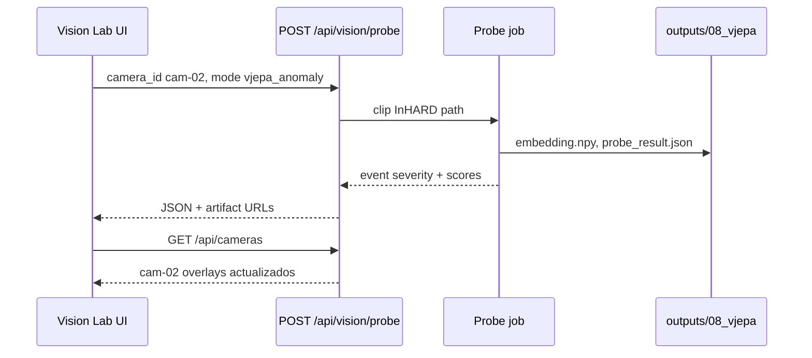
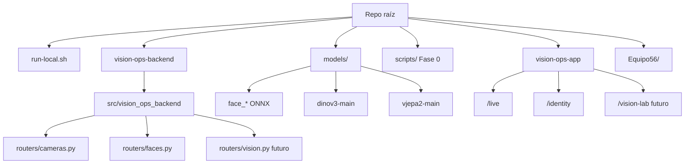

# VisionOps — Diagramas de arquitectura (Equipo 56)

Documento de referencia con los diagramas acordados para el **AI Co-Pilot / VisionOps**: backend local (`vision-ops-backend`), frontend (`vision-ops-app`), modelos en `models/`, y pipeline Fase 0 en `scripts/`.

**Relacionado:** [Project-context.md](./Project-context.md) · [Visión por Computador Industrial](./Visión%20por%20Computador%20Industrial:%20IA%20Co-Piloto.md) · [PRD.pdf](./PRD.pdf) · [Project-links.md](./Project-links.md)

**Última actualización:** mayo 2026

---

## 1. Vista general: quién posee la cámara

El navegador **no envía frames** al API en el flujo live actual. El backend abre la webcam (OpenCV), procesa en un hilo y **empuja** JPEGs al cliente.



| Pieza | Entrada | Salida |
|-------|---------|--------|
| `GET /api/cameras` | — | JSON: `status`, `streamUrl`, `overlays`, `error` |
| `GET /api/cameras/webcam-0/stream` | — | MJPEG continuo (cajas ya pintadas en servidor) |
| `POST /api/faces/enroll` | `{ "name": "..." }` | JSON; el servidor muestrea su propio buffer de webcam |

---

## 2. Flujo de datos Live (Camera 01 — webcam)



**Almacenamiento local (gitignored):**

- `vision-ops-backend/data/faces/owner.npz` — embedding + nombre
- `vision-ops-backend/data/faces/enrollment_preview.jpg` — referencia visual (no usada para match)
- Video live: solo RAM

---

## 3. Arranque local y modelos ONNX (cara)

```mermaid
flowchart TD
  A[./run-local.sh] --> B{¿Existen ONNX YuNet + SFace?}
  B -->|No| C[models/install_face_models.sh]
  C --> D[~40 MB Hugging Face]
  B -->|Sí| E[uv sync backend]
  D --> E
  E --> F[npm install frontend]
  F --> G[Backend :8000 + Frontend :3000]
  G --> H[/live y /identity]
```

**En git:** `models/install_face_models.sh`, `models/README.md`  
**No en git:** `*.onnx`, carpetas `face_detection_yunet/`, `face_recognition_sface/`

---

## 4. Cámara Android como fuente (Wi‑Fi — diseño)

Hoy solo `CAMERA_INDEX` (webcam Mac). Opción documentada: app **IP Webcam** en Android → URL HTTP → OpenCV.



| Método | Estado |
|--------|--------|
| Webcam Mac (`CAMERA_INDEX=0`) | Implementado |
| `CAMERA_SOURCE_URL=http://IP:8080/video` | Propuesto (env) |
| DroidCam como cámara virtual | Probar índices 1, 2, 3 |
| Browser en teléfono sube frames | No implementado (nuevo API) |

---

## 5. Dos pipelines: Camera 01 vs Camera 02+



| Cámara | Modelo | Modo | API |
|--------|--------|------|-----|
| 01 Webcam | YuNet + SFace | Tiempo real (&lt;100 ms objetivo edge) | `/api/faces/*`, `/api/cameras/.../stream` |
| 02 Warehouse (mock) | V-JEPA | Clip / batch | `/api/vision/*` (propuesto) |
| 01 Assembly (mock) | DINOv3 | Frame / batch | `/api/vision/*` (propuesto) |

---

## 6. API espejo: `/api/faces` vs `/api/vision` (implementado)

```mermaid
flowchart LR
  subgraph faces [/api/faces - implementado]
    F1[GET status]
    F2[GET storage]
    F3[POST enroll name]
    F4[GET preview JPG]
    F5[DELETE enroll]
  end
  subgraph vision [/api/vision - implementado]
    V1[GET status]
    V2[GET storage]
    V3[POST probe camera_id mode]
    V4[GET artifacts heatmap json]
    V5[overlays en GET /api/cameras]
  end
```

---

## 7. Sinergia DINOv3 + V-JEPA (marco académico)

Alineado a [Visión por Computador Industrial](./Visión%20por%20Computador%20Industrial:%20IA%20Co-Piloto.md) y README del repo.



| Modelo | Carpeta repo | Entrada | Uso en pruebas |
|--------|--------------|---------|----------------|
| DINOv3 | `models/dinov3-main/` | Frame | Heatmap, drift escena, ROI para clips |
| V-JEPA 2 | `models/vjepa2-main/` | Clip 16–64 frames | Embedding, anomalía, acciones InHARD |
| SFace/YuNet | `models/face_*` | Frame live | Identidad operador (Camera 01) |

---

## 8. Pipeline Fase 0 (`scripts/` — notebooks)



| Notebook | Salida principal |
|----------|------------------|
| 01 | `outputs/01_capture/` |
| 02 | `outputs/02_segments/clips/` |
| 03 | `outputs/03_track/tracks.jsonl` |
| 04 | `outputs/04_events/events.jsonl` |
| 08 | `outputs/08_vjepa/embedding.npy`, `probe_result.json` |

---

## 9. PRD vs implementación actual (decisión de stack)



**Decisión documentada en plan:** YOLO+DeepSORT para live; DINOv3/V-JEPA en clips (no bloquean MVP PRD).

---

## 10. Roadmap de pruebas en cámara mock (`cam-02`)



| Fase | Entregable |
|------|------------|
| T0 | Router `vision.py` + storage paths |
| T1 | Probe sobre clip InHARD → JSON anomalía |
| T2 | Heatmap DINO en `cam-01` |
| T3 | `GET /api/cameras` con `overlays` reales |
| T4 | `CAMERA_SOURCE_URL` o RTSP |

---

## 11. Ejemplo de probe (cuerpo API propuesto)



---

## 12. Mapa de rutas del repositorio



---

## 13. URLs locales (demo)

| Servicio | URL |
|----------|-----|
| Live UI | http://localhost:3000/live |
| Identidad facial | http://localhost:3000/identity |
| API health | http://localhost:8000/health |
| Proxy Next → API | `/vision-api/*` → `:8000` |

---

## Cómo ver los diagramas

- **GitHub / GitLab:** renderizado Mermaid nativo en `.md`
- **VS Code / Cursor:** preview Markdown con extensión Mermaid
- **Exportar PNG:** [mermaid.live](https://mermaid.live) — pegar bloque `mermaid`

---

_Equipo 56 — VisionOps. Complementa el PRD y el plan en `.cursor/plans/`._
