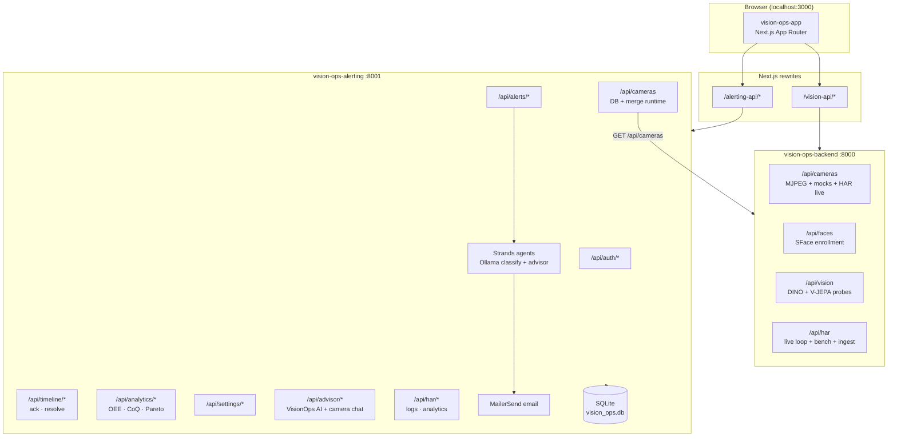
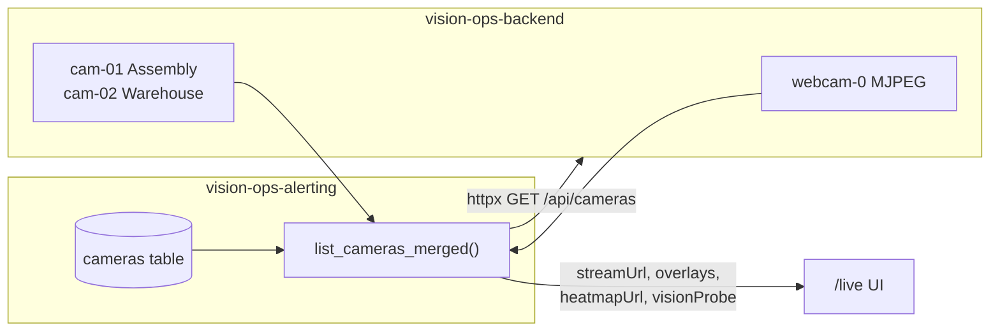
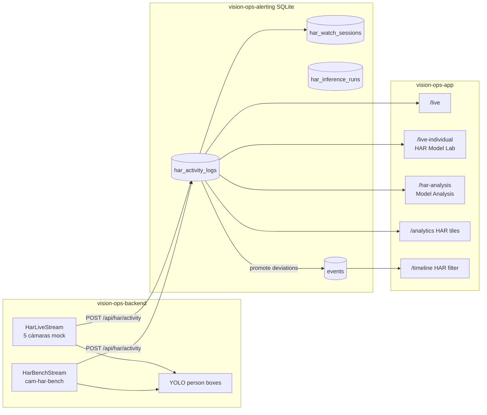

# AI Co-Pilot para el Piso de Producción: Ver, Guiar, Mejorar

> **VisionOps** — Sistema de inteligencia visual para un **Gemelo Digital de Planta** que convierte cámaras IP (RTSP/ONVIF) en comprensión operativa en tiempo real, asistiendo a supervisores sin sustituirlos.

**Titular / Divulgante:** Alignity IQ Edge, LLC — Houston, Texas, EUA  
**Equipo #56 (MNA-V · Tec de Monterrey, Campus Estado de México):** Landy Haydee Schlebach Osorio · Carlos Pano Hernández · Carlos Fernando Del Castillo Rey  
**Asesor académico:** Dr. Gerardo Camacho  
**Patrocinador industrial:** Dr. José Jacobo Eluani Vázquez (Representante Legal, Alignity IQ Edge, LLC)

**Documentos de referencia (repositorio):**

| Documento | Contenido |
|-----------|-----------|
| `Avance 1. Analisis exploratorio de datos/Main_ AI CoPilot Ver Guiar Mejorar (1).pptx.pdf` | Problema industrial, pilares Ver·Guiar·Mejorar, alcance del prototipo |
| `Avance 1. Analisis exploratorio de datos/Enterprise_AI_Project_Launch.pptx.pdf` | Presentación de lanzamiento del proyecto Enterprise AI |
| `Avance 1. Analisis exploratorio de datos/NDA_VisionOps_AlignityIQEdge_FirmadoXLandy.pdf` | Marco legal, definición formal de VisionOps y activos protegidos |
| [`Paper/main.tex`](Paper/main.tex) | **Manuscrito académico IMRaD** (LaTeX): pipeline per-person HAR, EDA InHARD, resultados piloto |

---

## Contexto del problema

En muchas fábricas **no se sabe realmente qué ocurre en el piso de producción** — solo se ven resultados al final del turno o del mes. La supervisión depende de recorridos físicos, monitores pasivos o reportes manuales. Eso genera:

- **Errores humanos y variabilidad** entre operadores y turnos  
- **Falta de visibilidad en tiempo real** sobre acciones, inactividad y desvíos de proceso  
- **Retraso entre el evento y la acción correctiva** (minutos u horas, no segundos)  
- **Capacitación reactiva** en lugar de guía contextual en el momento

El problema **no es la falta de datos** — hay cámaras, sensores y registros — sino la **interpretación mientras ocurre**. Esto impacta directamente productividad, calidad, seguridad y entrenamiento, y es parte del camino hacia **fábricas inteligentes (Industria 4.0)**.

La propuesta de Alignity IQ Edge es un **copiloto de IA** que observa, entiende y ayuda a mejorar la operación: no solo monitoreo pasivo, sino colaboración humano–IA en el piso.

---

## Visión del proyecto: VisionOps

**VisionOps** es el nombre formal del sistema (Acuerdo de Confidencialidad, 2026): un sistema de **inteligencia visual basado en IA** que procesa flujos de video en tiempo real para crear un **Gemelo Digital de Planta** — una representación digital dinámica del entorno industrial derivada de múltiples streams simultáneos.

### Objetivo estratégico

Construir un entorno donde humanos e IA colaboran en la operación diaria:

| Dimensión | Capacidad | Resultado esperado |
|-----------|-----------|-------------------|
| **Reconocimiento** | Detectar acciones, identificar errores, monitorear procesos | Saber *qué* está pasando, *dónde* y *cuándo* |
| **Guía** | Acompañar al operador, validar pasos, sugerir correcciones | Intervenir antes de que el desvío escale |
| **Optimización** | Analizar tiempos y movimientos, detectar ineficiencias | Mejorar productividad con evidencia visual |

Estos tres ejes se materializan en el lema del proyecto: **Ver · Guiar · Mejorar**.

### Alcance del prototipo (marco académico)

El objetivo del proyecto integrador **no es un sistema industrial completo**, sino un **prototipo funcional** que valide el concepto en un horizonte acotado (~3 meses):

1. **Definir un caso real** de manufactura o logística (acciones operativas, zonas, desvíos típicos)  
2. **Aprovechar modelos pre-entrenados** de visión por computadora (fundacionales + HAR) en lugar de entrenar desde cero  
3. **Desarrollar lógica de decisión** — reglas, clasificación de casos, alertas y validación de pasos  
4. **Entregar un demo integrado** — ingestión de video, inferencia, bitácora, dashboard y asesor IA

**Fuentes de datos previstas:** datasets abiertos con video etiquetado (p. ej. **InHARD**), clips simulados o capturados durante el proyecto, y datos generados por el equipo en notebooks de experimentación.

### Activos del ecosistema VisionOps (marco NDA)

El acuerdo de confidencialidad define cuatro familias de activos que este repositorio desarrolla o prototipa:

| Familia | Ejemplos en el repo |
|---------|---------------------|
| **Activos de visión** | Streams MJPEG/RTSP, heatmaps DINO, timelines semánticos, bitácora visual |
| **Activos de IA** | YOLOv8 (personas), DeepSORT (tracking), DINOv2/V-JEPA 2 (HAR y anomalías), embeddings SFace, orquestación Strands + Ollama |
| **Activos de infraestructura** | Servicios FastAPI (`vision-ops-backend`, `vision-ops-alerting`), ingestión multi-stream, despliegue local/edge vía `run-local.sh` |
| **Activos de negocio** | Bitácora Visual Automatizada, alertas de cuellos de botella, KPIs (OEE, CoQ, Pareto), detección de montacargas/operador inactivo, workflow ack/resolve |

> **Confidencialidad:** el código, modelos fine-tuned, datasets curados y metodologías derivadas son propiedad de Alignity IQ Edge, LLC. Uso académico bajo NDA; no replicar la Bitácora Visual ni publicar activos protegidos sin aprobación escrita.

---

## Resumen ejecutivo

Este repositorio contiene **dos capas complementarias**:

1. **Investigación ML** — pipeline reproducible en `notebooks/` (00–06), checkpoints HAR, código DINOv3/V-JEPA en `models/`  
2. **Demo VisionOps integrado** — tres servicios ejecutables que simulan el flujo productivo end-to-end

| Pilar | Qué resuelve en planta | Implementación en el demo |
|-------|------------------------|---------------------------|
| **Ver** | Ingesta multi-cámara y comprensión de escena/acción | Webcam MJPEG + mocks industriales + **5 modelos HAR** (DINOv2/V-JEPA 2) en loop live + probes DINO heatmap / V-JEPA anomalía + YOLO personas + SFace |
| **Guiar** | Alertas en baja latencia y acompañamiento operativo | Reglas SQLite, clasificador Strands/Ollama, email MailerSend, promoción de desvíos HAR a Timeline, chat por cámara |
| **Mejorar** | Bitácora visual, KPIs post-turno, mejora continua | Timeline industrial (ack → resolve), OEE/CoQ/Pareto, plant settings, **VisionOps AI Advisor**, análisis comparativo de modelos HAR |

**Capacidades recientes del demo:** autenticación email/contraseña, atribución por usuario en timeline y alertas, **Settings** (costos y fórmulas KPI), analytics industrial, campana de notificaciones, bot flotante **VisionOps AI Advisor**, **HAR Model Lab** (`/live-individual`) con banco de pruebas interactivo, **Model Analysis** (`/har-analysis`), logging integral HAR → SQLite, servidor MCP opcional para agentes.

---

## Panorama de los tres servicios

El demo ejecutable une **percepción visual** (backend), **orquestación operativa** (alerting) y **experiencia de supervisor** (frontend). Cada servicio tiene un rol claro en el gemelo digital.

### vision-ops-backend — Percepción e inferencia (`:8000`)

**Responsabilidad:** convertir pixels en señales accionables. Es la capa *edge* del sistema: captura video, ejecuta modelos y expone streams y artefactos.

| Módulo | Función | Tecnología |
|--------|---------|------------|
| **Cámaras** | Webcam MJPEG (`webcam-0`), mocks industriales (`cam-01` ensamble, `cam-02` almacén), cinco feeds HAR (`cam-har-01`…`05`) | OpenCV, FastAPI streaming |
| **Identidad** | Enrollment y reconocimiento facial del supervisor | YuNet + SFace ONNX |
| **Visión fundacional** | Mapas de calor espaciales y detección de anomalías temporales | DINOv3 (heatmap), V-JEPA 2 (score de anomalía) |
| **HAR (Human Action Recognition)** | Clasificación de acciones industriales en ventanas deslizantes sobre video InHARD | 5 checkpoints Avance 4: DINOv2 puro/MC-JEPA, V-JEPA 2 puro/MC-JEPA frozen/partial |
| **Detección de personas** | Bounding boxes para contexto multi-persona | YOLOv8 |
| **HAR Live + Bench** | Loop continuo sobre clips MP4 mock; banco interactivo (`cam-har-bench`) con cambio de modelo/video en caliente | `HarLiveStream`, `HarBenchManager` |
| **Ingesta downstream** | POST de cada ventana inferida hacia alerting | `POST /api/har/activity` (vía cliente HTTP) |

**Principio de diseño:** el backend **no persiste estado operativo de negocio** — solo runtime (streams, probes, embeddings locales). La bitácora y KPIs viven en alerting.

### vision-ops-alerting — Orquestación, bitácora y negocio (`:8001`)

**Responsabilidad:** cerebro operativo del gemelo digital — reglas, eventos, analytics, auth, email y agentes IA con contexto de planta.

| Módulo | Función | Tecnología |
|--------|---------|------------|
| **Persistencia** | Fuente de verdad SQLite (`vision_ops.db`) | SQLAlchemy, WAL mode |
| **Autenticación** | Login/registro, JWT, atribución de acciones de workflow | bcrypt + Bearer tokens |
| **Alert pipeline** | Clasificar contexto industrial → regla habilitada → email → evento timeline | Strands + Ollama, MailerSend |
| **Timeline / Bitácora Visual** | Eventos semánticos con workflow ack → resolve, códigos de razón, export PDF | `events`, `industrial_reason_codes` |
| **HAR logging** | Logs integrales por cámara, sesiones de watch, promoción de desvíos | `har_activity_logs`, `har_watch_sessions` |
| **Analytics industrial** | OEE, Cost of Quality, Pareto, heatmaps 10×10, insights de turno | `plant_config` + agregaciones |
| **Cámaras (merge)** | Metadatos en DB + runtime del backend en un solo `GET /api/cameras` | httpx merge |
| **VisionOps AI Advisor** | Chat contextual con herramientas sobre DB (eventos abiertos, KPIs, logs HAR) | Strands + Ollama, `advisor_agent.py` |
| **Camera chat** | Asesor acotado a una cámara y sus logs HAR recientes | `camera_advisor_context.py` |
| **MCP (opcional)** | Exponer snapshot operativo a Cursor/agentes externos | `mcp/db_context_server.py` |

**Principio de diseño:** toda **decisión que afecta al supervisor** (¿enviar alerta?, ¿qué severidad?, ¿quién cerró el incidente?) pasa por alerting.

### vision-ops-app — Experiencia del supervisor (`:3000`)

**Responsabilidad:** dashboard unificado para Ver, Guiar y Mejorar — sin exigir que el operador conozca la arquitectura de microservicios.

| Ruta | Pilar | Descripción |
|------|-------|-------------|
| `/analytics` | Mejorar | **Home por defecto** — OEE, CoQ, Pareto, heatmap, insights, tiles HAR |
| `/timeline` | Mejorar | Bitácora post-turno — filtros, thumbnails, ack/resolve, resumen IA de turno |
| `/alerts` | Guiar | CRUD de reglas, plantillas email, prueba de dispatch, estado Ollama |
| `/settings` | Mejorar | Variables de planta, fórmulas KPI editables |
| `/live` | Ver | Grid multi-cámara — streams, overlays HAR, chat por cámara, eventos en tiempo real |
| `/live-individual` | Ver | **HAR Model Lab** — un stream bench, selector de modelo/video, controles de inferencia |
| `/har-analysis` | Mejorar | **Model Analysis** — comparativa de modelos, métricas de confianza y desvíos |
| `/login` | — | Autenticación obligatoria antes del dashboard |
| `/identity`, `/vision-lab` | Ver | Ocultas en sidebar (redirect a Analytics); código conservado para enrollment SFace y probes DINO/V-JEPA |

**Proxies:** el browser llama `/vision-api/*` → backend y `/alerting-api/*` → alerting (`next.config.ts`), evitando CORS en desarrollo.

**Asesor flotante:** componente `VisionOpsAdvisor` en todas las páginas del dashboard — contexto según ruta activa.

### Roadmap: prototipo → producción

El demo actual **simula** capacidades que VisionOps desplegará en planta real (según NDA y presentación del patrocinador):

| Capacidad demo | Estado actual | Target industrial |
|----------------|---------------|-------------------|
| Ingesta de video | Webcam + MP4 mock | RTSP/ONVIF multi-cámara en edge (Mini-PC/NUC) |
| HAR / acciones | 5 modelos fine-tuned InHARD | Modelos calibrados por línea/cliente Alignity |
| Alertas | Email MailerSend + reglas SQLite | SMS, andon, integración MES/ERP |
| Asesor IA | Ollama local + Strands | VLM (Gemini Vision / GPT-4V) + contexto operativo |
| Gemelo digital | Dashboard + timeline + KPIs | Representación 3D/espacial de zonas y flujos |
| Privacidad | SFace opt-in, datos locales | Políticas por sitio, retención configurable |

---

## VisionOps demo stack (for developers & AI agents)

The runnable demo consists of **three services** started together via `./run-local.sh`:

| Service | Directory | Port | Role |
|---------|-----------|------|------|
| **vision-ops-backend** | `vision-ops-backend/` | **8000** | Webcam MJPEG, SFace, DINO/V-JEPA probes, HAR live/bench (5 modelos), YOLO |
| **vision-ops-alerting** | `vision-ops-alerting/` | **8001** | SQLite, alert rules, timeline, HAR logs, analytics, auth, email, AI advisor |
| **vision-ops-app** | `vision-ops-app/` | **3000** | Next.js 16 dashboard — Analytics, Timeline, Alerts, Settings, Live, HAR Model Lab, Model Analysis, login, AI advisor |

### System architecture



### Alert pipeline (email → timeline)


### Live camera data flow



**Key design choice:** Camera **metadata** lives in alerting SQLite; **runtime** (streams, probe artifacts) comes from vision-ops-backend. The alerting service merges both on `GET /api/cameras`.

### HAR integral logging (live mock videos)



**Cinco modelos HAR (Avance 4)** — entrenados sobre acciones industriales tipo InHARD (*Assemble system*, *Take component*, etc.):

| ID | Arquitectura | Cámara mock |
|----|--------------|-------------|
| `dinov2-puro` | DINOv2 backbone, head lineal | `cam-har-01` |
| `dinov2-mcjepa` | DINOv2 → MC-JEPA | `cam-har-02` |
| `vjepa2-puro` | V-JEPA 2 backbone | `cam-har-03` |
| `vjepa2-mcjepa-frozen` | V-JEPA 2 + MC-JEPA (encoder congelado) | `cam-har-04` |
| `vjepa2-mcjepa-partial` | V-JEPA 2 + MC-JEPA (fine-tune parcial) | `cam-har-05` |

- Cada ventana de inferencia live se appendea a **`har_activity_logs`** (acción, confianza, top-k, detecciones YOLO, índice de persona opcional).
- Acciones no-ensamble o baja confianza generan eventos en **Timeline** (`har_action_deviation`); email permanece en **dry-run**.
- **HAR Model Lab** (`/live-individual`): stream único `cam-har-bench` con selector de modelo, video, FPS de inferencia y overlays configurables.
- **Model Analysis** (`/har-analysis`): agregados diarios, comparativa entre modelos, enlaces al lab.
- **Chat por cámara** en Live/Lab: `POST /api/advisor/camera-chat` (contexto acotado a logs de esa cámara).
- **VisionOps AI Advisor** global: herramientas HAR en páginas Analytics/Live.

| Env (alerting) | Default | Role |
|----------------|---------|------|
| `ALERTING_DRY_RUN` | `true` | No real MailerSend |
| `ALERTING_HAR_EMAIL_ENABLED` | `false` | Never email on HAR events |
| `ALERTING_HAR_PROMOTE_NON_ASSEMBLY` | `true` | Timeline events when label ≠ Assemble system |
| `ALERTING_HAR_LOW_CONFIDENCE_THRESHOLD` | `0.15` | Promote low-confidence predictions |
| `ALERTING_HAR_LOG_RETENTION_DAYS` | `7` | Prune old log rows |

| Env (backend) | Default | Role |
|---------------|---------|------|
| `HAR_ACTIVITY_INGEST_ENABLED` | `true` | POST live/probe rows to alerting |
| `HAR_LIVE_ENABLED` | `true` | Loop mock MP4s with sliding-window HAR |

### Python environments (three packages)

| Directory | Tool | Purpose |
|-----------|------|---------|
| Repository root | `pyproject.toml` + `uv sync --all-groups` | Notebooks, YOLO/DeepSORT research |
| `vision-ops-backend/` | `uv sync` | FastAPI webcam + face + vision probes |
| `vision-ops-alerting/` | `uv sync` (+ `--extra mcp` for MCP server) | FastAPI alerts, SQLite, Strands agents, JWT auth |
| `vision-ops-app/` | `npm install` | Next.js frontend |

Root `requirements.txt` is a legacy pip pin list for notebooks; prefer **`uv sync`** at root or in each service directory.

---

## Repository structure

```text
.
├── run-local.sh                 # Arranca los 3 servicios + Ollama (recomendado)
├── Avance 1. Analisis exploratorio de datos/   # PDFs: problema, NDA, lanzamiento Enterprise AI
├── vision-ops-backend/          # FastAPI — webcam, faces, vision probes, HAR live (:8000)
│   ├── src/vision_ops_backend/
│   │   ├── main.py              # Lifespan: webcam, HarLiveStream, HarBenchManager
│   │   ├── routers/             # cameras, faces, vision, har, health
│   │   ├── face/                # YuNet + SFace ONNX live recognition
│   │   └── vision/              # DINO heatmap, V-JEPA anomaly, HAR inference
│   │       └── har/             # live_stream, har_bench, probe_runner, inference
│   ├── data/faces/              # gitignored — enrollment embeddings
│   └── data/vision/             # gitignored — probe artifacts
├── vision-ops-alerting/         # FastAPI — rules, timeline, email, auth, advisor, HAR API (:8001)
│   ├── src/vision_ops_alerting/
│   │   ├── main.py
│   │   ├── agent.py             # Strands alert classifier + MailerSend
│   │   ├── advisor_agent.py     # Strands floor advisor (chat)
│   │   ├── strands_invoke.py    # Invocación Ollama vía Strands
│   │   ├── ollama_model.py      # Health/model helpers
│   │   ├── auth_deps.py         # JWT Bearer dependency
│   │   ├── db/models.py         # SQLAlchemy models (source of truth)
│   │   ├── routers/             # auth, alerts, timeline, analytics, settings, advisor, har, …
│   │   └── services/            # events, HAR store/dispatch, industrial_analytics, camera_advisor
│   ├── mcp/db_context_server.py # Optional MCP — SQLite ops context for Cursor
│   ├── docs/schema.sql          # Reference DDL (may lag models.py)
│   └── data/vision_ops.db       # gitignored — auto-created SQLite
├── vision-ops-app/              # Next.js 16 + React 19 + Tailwind 4 (:3000)
│   ├── app/(dashboard)/         # analytics, timeline, alerts, settings, live, live-individual, har-analysis
│   ├── app/login/               # Email/password sign-in + register
│   ├── components/advisor/      # VisionOps AI floating chat
│   ├── components/live/         # LivePageClient, HarBenchControls, playback sync
│   ├── components/har-analysis/  # Model Analysis dashboard
│   ├── lib/api.ts               # All fetch helpers + proxy URL logic + JWT headers
│   └── next.config.ts           # /vision-api and /alerting-api rewrites
├── models/                      # DINOv3, V-JEPA reference code + face ONNX installer
├── notebooks/                   # ML experimentation (Avance 4 HAR checkpoints)
├── data_sample/InHARD-master/   # Dataset industrial de referencia (acciones de planta)
├── pyproject.toml               # Root Python deps (research / notebooks)
└── README.md
```

---

## Prerequisites

| Tool | Version | Used by |
|------|---------|---------|
| **Python** | 3.11–3.12 | Both FastAPI backends (`requires-python >=3.11,<3.13`) |
| **[uv](https://docs.astral.sh/uv/)** | latest | Python dependency management |
| **Node.js + npm** | 20+ recommended | `vision-ops-app` |
| **macOS camera access** | — | Webcam stream + face enrollment (Terminal/IDE permission) |
| **Ollama** | [ollama.com](https://ollama.com/download) | **Required** for VisionOps AI Advisor + alert classifier (Strands); `./run-local.sh` starts `ollama serve` if installed |
| **Internet** (first run) | — | Face ONNX download (~40 MB), npm packages |

### One-time setup

```bash
# Install uv
curl -LsSf https://astral.sh/uv/install.sh | sh

git clone <url-del-repositorio>
cd AI-Co-Pilot-for-the-Production-Floor-See-Guide-Improve

# Root research environment (notebooks, optional)
uv sync --all-groups

# Face models (required for Identity page — not in git)
./models/install_face_models.sh

# Env files (run-local.sh copies from .example if missing)
cp vision-ops-app/.env.local.example vision-ops-app/.env.local
cp vision-ops-alerting/.env.example vision-ops-alerting/.env
cp vision-ops-backend/.env.example vision-ops-backend/.env   # optional
```

---

## Quick start (all services)

From the **repository root**:

```bash
./run-local.sh
```

This script:

1. Ensures face ONNX models exist (`models/install_face_models.sh`) when webcam is enabled
2. Runs `uv sync` in backend + alerting
3. Runs `npm install` in frontend if needed
4. **Ollama (Advisor LLM):** `brew install --cask ollama` (not the broken `brew install ollama` formula), opens **Ollama.app**, then `ollama pull llama3.1` if needed (first pull can take several minutes). If you already installed the formula: `brew uninstall ollama && brew install --cask ollama`
5. Frees ports 8000, 8001, 3000
6. Starts all three servers (webcam off by default; set `WEBCAM_ENABLED=true` for live camera)

Skip automatic Ollama install/pull: `OLLAMA_AUTO_INSTALL=false OLLAMA_AUTO_PULL=false ./run-local.sh`

| URL | Page |
|-----|------|
| http://localhost:3000/login | Sign in / create account (required before dashboard) |
| http://localhost:3000/analytics | **Default home** — OEE, CoQ, Pareto, heatmap, KPI tooltips, tiles HAR |
| http://localhost:3000/timeline | Post-shift log — ack / resolve workflow, filtros HAR |
| http://localhost:3000/alerts | Alert rules + email templates CRUD |
| http://localhost:3000/settings | Plant cost variables + KPI formula reference |
| http://localhost:3000/live | Multi-cámara — streams HAR live, chat por cámara, eventos |
| http://localhost:3000/live-individual | **HAR Model Lab** — bench interactivo, un modelo a la vez |
| http://localhost:3000/har-analysis | **Model Analysis** — comparativa de los 5 modelos HAR |
| http://localhost:3000/vision-lab | *(hidden)* redirects to Analytics — probes DINO/V-JEPA |
| http://localhost:3000/identity | *(hidden)* redirects to Analytics — face enrollment (SFace) |
| http://localhost:8000/health | Backend liveness |
| http://localhost:8001/health | Alerting liveness |
| http://localhost:8001/docs | Alerting OpenAPI (auth, advisor, timeline, …) |

**Default login** (seeded on first start when `users` is empty): `admin@visionops.local` / `admin123`

**VisionOps AI Advisor:** blue floating button (bottom-right) on every dashboard page — context-aware chat powered by Strands + Ollama.

### Run services individually

```bash
# Backend only
cd vision-ops-backend && uv sync
uv run uvicorn vision_ops_backend.main:app --reload --host 0.0.0.0 --port 8000

# Alerting only
cd vision-ops-alerting && uv sync
uv run uvicorn vision_ops_alerting.main:app --reload --host 0.0.0.0 --port 8001

# Frontend only
cd vision-ops-app && npm install && npm run dev
```

---

## Environment variables

### vision-ops-app (`vision-ops-app/.env.local`)

| Variable | Default | Purpose |
|----------|---------|---------|
| `NEXT_PUBLIC_API_URL` | `http://localhost:8000` | vision-ops-backend (rewrites + SSR) |
| `NEXT_PUBLIC_ALERTING_URL` | `http://localhost:8001` | vision-ops-alerting (SSR direct fetch) |

Browser calls use proxies defined in `next.config.ts`:

- `/vision-api/*` → backend `:8000`
- `/alerting-api/*` → alerting `:8001`

### vision-ops-backend (`vision-ops-backend/.env`)

| Variable | Default | Purpose |
|----------|---------|---------|
| `WEBCAM_ENABLED` | `false` | Open MacBook camera on startup (set `true` for `/live` + Identity) |
| `CAMERA_INDEX` | `0` | Webcam device index when `WEBCAM_ENABLED=true` |
| `CORS_ORIGINS` | `http://localhost:3000,...` | Must include your UI origin |
| `PUBLIC_API_BASE` | `http://localhost:8000` | Absolute stream URLs in JSON |
| `MJPEG_FPS` | `12` | Webcam stream frame rate |
| `FACE_ENABLED` | `false` | SFace overlay on MJPEG (requires `WEBCAM_ENABLED=true`) |
| `OWNER_NAME` | `You` | Default display name |
| `VISION_ENABLED` | `true` | Include cam-01/cam-02 mock cameras |
| `HAR_ENABLED` | `true` | Include cam-har-01…05 (Avance 4 activity models) |
| `HAR_CHECKPOINT_DIR` | `notebooks/Avance 4. Modelos alternativos/Checkpoints` | Trained `.pt` weights for HAR APIs |
| `HAR_SHARED_CLIP_PATH` | *(empty)* | Optional fixed `.mp4` for all HAR probes |

### vision-ops-alerting (`vision-ops-alerting/.env`)

All vars use prefix `ALERTING_` (see `.env.example`):

| Variable | Default | Purpose |
|----------|---------|---------|
| `ALERTING_DRY_RUN` | `true` | Safe default — no real email unless `false` |
| `ALERTING_MAILERSEND_API_TOKEN` | — | Required for real sends |
| `ALERTING_FROM_EMAIL` / `ALERTING_TO_EMAIL` | — | Sender + comma-separated recipients |
| `ALERTING_OLLAMA_MODEL` | `llama3.1` | Strands classifier model |
| `ALERTING_CORS_ORIGINS` | `http://localhost:3000` | CORS |
| `ALERTING_AUTH_SECRET` | dev default | JWT signing — **change in production** |
| `ALERTING_AUTH_TOKEN_HOURS` | `72` | Session token lifetime |
| `ALERTING_SEED_ADMIN_EMAIL` | `admin@visionops.local` | First-user seed when `users` table is empty |
| `ALERTING_SEED_ADMIN_PASSWORD` | `admin123` | Default admin password (dev only) |
| `ALERTING_SEED_ADMIN_NAME` | `Plant Supervisor` | Display name on workflow actions |
| `ALERTING_SEED_DB` | `false` | If `true`, inserts demo rules/events on empty DB |
| `ALERTING_DATABASE_URL` | `sqlite:///.../data/vision_ops.db` | SQLite path (use absolute path in DBeaver) |
| `ALERTING_VISION_BACKEND_URL` | `http://localhost:8000` | Health/latency probes |

### Root `.env` (optional — notebooks only)

Not used by `./run-local.sh`. Copy from `.env.example` only if you run root notebook experiments.

| Variable | Purpose |
|----------|---------|
| `REDIS_URL` | Optional event buffer for notebook 04 (`redis://localhost:6379/0`) |

Demo auth uses `ALERTING_AUTH_SECRET` in `vision-ops-alerting/.env`, not the root `.env`.

---

## Authentication

Simple **email + password** login (no OAuth). Implemented in **vision-ops-alerting**; the Next.js app stores a JWT in `localStorage` and sends `Authorization: Bearer …` on mutating API calls.

| Item | Detail |
|------|--------|
| UI | `/login` — sign in or create account (name, email, password) |
| API | `POST /api/auth/login`, `POST /api/auth/register`, `GET /api/auth/me` |
| Storage | SQLite table `users` (`id`, `email`, `name`, `password_hash`, `created_at`) |
| Roles | **Not implemented** — all authenticated users share the same permissions |
| Attribution | User **display name** stored on `events.acknowledged_by`, `events.resolved_by`, `alert_rules.updated_by`, `plant_config.updated_by` |

Protected routes (require Bearer token): timeline ack/resolve, alert rule CRUD, email template CRUD, plant settings PATCH.

```bash
# Login (returns token + user)
curl -s -X POST http://localhost:8001/api/auth/login \
  -H 'Content-Type: application/json' \
  -d '{"email":"admin@visionops.local","password":"admin123"}' | jq .

# Use token on protected calls
TOKEN="<paste token>"
curl -s -X PATCH http://localhost:8001/api/timeline/evt-xxx/acknowledge \
  -H "Authorization: Bearer $TOKEN"
```

---

## VisionOps AI Advisor (chat bot)

Floating **ops advisor** on every dashboard page (`components/advisor/VisionOpsAdvisor.tsx`). Uses the same **Strands + Ollama** stack as alert classification, with tools that query live SQLite context (cameras, open events, rules, KPIs).

| Endpoint | Purpose |
|----------|---------|
| `GET /api/advisor/welcome?page=live` | Intro when chat opens (page-aware) |
| `POST /api/advisor/chat` | User message → advisor reply + snapshot |
| `GET /api/advisor/context` | Raw operational snapshot (debug / MCP parity) |

Requires **Ollama** with `ALERTING_OLLAMA_MODEL` (default `llama3.1`) for full replies; deterministic fallbacks exist for greetings.

### Optional MCP server (Cursor / agents)

`vision-ops-alerting/mcp/db_context_server.py` exposes the same DB context over MCP stdio:

```bash
cd vision-ops-alerting
uv sync --extra mcp
uv run python mcp/db_context_server.py
```

See file header for Cursor `mcpServers` JSON config.

---

## Database schema (vision-ops-alerting)

**File:** `vision-ops-alerting/data/vision_ops.db` (gitignored, WAL mode, auto-created on startup)

**Source of truth:** `vision-ops-alerting/src/vision_ops_alerting/db/models.py`  
**Reference DDL:** `vision-ops-alerting/docs/schema.sql`

### Entity relationship


### Tables summary

| Table | Purpose |
|-------|---------|
| `users` | App login accounts (bcrypt passwords) |
| `cameras` | Camera registry for Live UI; links to backend via `backend_camera_id` (e.g. `webcam-0`, `cam-01`) |
| `alert_rules` | Configurable rules on `/alerts`; one enabled rule per `case_type` required for email dispatch |
| `email_templates` | Built-in + cloned HTML email templates per case type |
| `events` | Timeline incidents — includes workflow: `resolution_status`, `acknowledged_by/at`, `resolved_by/at`, reason codes, downtime/scrap |
| `alert_deliveries` | Email send log linked to events |
| `industrial_reason_codes` | Close-out reason codes for timeline resolve modal |
| `plant_config` | Editable plant costs, shift hours, KPI floors/ceilings (Settings page) |
| `analytics_daily` | Shift KPI snapshots (OEE components, uptime, flow) |
| `analytics_heatmaps` | 10×10 grid JSON per camera/shift/date |
| `health_metric_samples` | Telemetry history (backend latency probes) |
| `har_activity_logs` | Log integral HAR por cámara (live + probe): acción, confianza, top-k, YOLO JSON |
| `har_watch_sessions` | Sesiones de observación HAR por cámara/video |
| `har_inference_runs` / `har_inference_results` | Historial de probes batch (`probe-all`) |

**DBeaver tip:** connect to the absolute path printed by `uv run python -c "from vision_ops_alerting.config import settings; print(settings.database_url)"`. Refresh schema (F5) after upgrades. While `run-local.sh` runs, SQLite uses WAL mode (`vision_ops.db-wal`).

### Startup seed behavior

On every startup (`init_db()`):

- Creates tables if missing (+ incremental SQLite migrations in `db/session.py`)
- Seeds **default admin user** if `users` is empty (`admin@visionops.local` / `admin123`)
- Seeds **default cameras** if `cameras` table is empty
- Ensures **built-in email templates** and **industrial reason codes**
- Ensures **default action rules** (one rule per case type)
- Ensures **default plant_config** row

If `ALERTING_SEED_DB=true` and `alert_rules` is empty, also inserts demo rules, events, and analytics rows (`db/seed.py`).

---

## API reference

Base URLs:

- Backend: `http://localhost:8000`
- Alerting: `http://localhost:8001`
- Via frontend proxy: `http://localhost:3000/vision-api/...` and `/alerting-api/...`

Interactive OpenAPI docs (when servers are running):

- http://localhost:8000/docs
- http://localhost:8001/docs

---

### vision-ops-backend (`:8000`)

#### Health

```bash
curl -s http://localhost:8000/health
# {"status":"ok"}
```

#### Cameras

```bash
# List webcam + industrial mocks (cam-01, cam-02, cam-har-01…05 when enabled)
curl -s http://localhost:8000/api/cameras | jq .

# MJPEG stream (open in browser or )
open "http://localhost:8000/api/cameras/webcam-0/stream"
```

#### Face enrollment (SFace + YuNet)

```bash
curl -s http://localhost:8000/api/faces/status | jq .

curl -s http://localhost:8000/api/faces/storage | jq .

# Enroll (webcam must be running)
curl -X POST http://localhost:8000/api/faces/enroll \
  -H 'Content-Type: application/json' \
  -d '{"name":"Carlos"}'

# Remove enrollment
curl -X DELETE http://localhost:8000/api/faces/enroll
```

#### Vision probes (DINO + V-JEPA)

```bash
curl -s http://localhost:8000/api/vision/status | jq .

# Assembly camera — DINO heatmap
curl -X POST http://localhost:8000/api/vision/probe \
  -H 'Content-Type: application/json' \
  -d '{"camera_id":"cam-01","mode":"auto"}'

# Warehouse camera — V-JEPA anomaly
curl -X POST http://localhost:8000/api/vision/probe \
  -H 'Content-Type: application/json' \
  -d '{"camera_id":"cam-02","mode":"auto","set_baseline":true}'

# Fetch heatmap overlay JPEG
curl -o heatmap.jpg http://localhost:8000/api/vision/artifacts/cam-01/overlay
```

| Method | Path | Description |
|--------|------|-------------|
| GET | `/health` | Liveness |
| GET | `/api/cameras` | Camera list with `streamUrl`, overlays |
| GET | `/api/cameras/{id}/stream` | MJPEG multipart (webcam-0 only) |
| GET | `/api/faces/status` | Enrollment state |
| GET | `/api/faces/storage` | Paths + privacy explanation |
| GET | `/api/faces/preview` | Enrollment preview JPEG |
| POST | `/api/faces/enroll` | Capture samples → embedding |
| DELETE | `/api/faces/enroll` | Remove enrollment |
| GET | `/api/vision/status` | Probe state for cam-01, cam-02 |
| GET | `/api/vision/har/status` | HAR probe state (five Avance 4 models) |
| POST | `/api/vision/har/probe-all` | Run all HAR classifiers on shared clip |
| GET | `/api/har/runs` | HAR probe batch history (alerting SQLite) |
| GET | `/api/har/results/latest` | Latest prediction per model |
| POST | `/api/har/activity` | Ingest live/probe activity log row(s) |
| GET | `/api/har/activity` | Paginated integral logs per camera |
| GET | `/api/har/analytics/daily` | Action mix, hourly counts, deviations |
| GET | `/api/har/analytics/realtime` | Last N minutes rollup |
| POST | `/api/advisor/camera-chat` | Per-camera HAR chat (Live feeds) |
| GET | `/api/notifications/recent` | Recent events incl. HAR deviations |
| GET | `/api/vision/storage` | Artifact paths |
| POST | `/api/vision/probe` | Run DINO or V-JEPA probe |
| GET | `/api/vision/artifacts/{id}/overlay` | Heatmap overlay image |
| GET | `/api/vision/artifacts/{id}/still` | Cached still frame |
| GET | `/api/vision/artifacts/{id}/preview` | Probe preview |
| GET | `/api/vision/cameras/{id}/last` | Last probe JSON |

---

### vision-ops-alerting (`:8001`)

#### Auth

```bash
curl -s -X POST http://localhost:8001/api/auth/login \
  -H 'Content-Type: application/json' \
  -d '{"email":"admin@visionops.local","password":"admin123"}' | jq .

curl -s http://localhost:8001/api/auth/me \
  -H "Authorization: Bearer $TOKEN" | jq .
```

#### Health & telemetry

```bash
curl -s http://localhost:8001/health
# {"ok":true,"service":"vision-ops-alerting"}

curl -s http://localhost:8001/api/telemetry | jq .
curl -s http://localhost:8001/api/notifications/email/status | jq .
```

#### Cameras (SQLite + backend merge)

```bash
curl -s "http://localhost:8001/api/cameras" | jq .
curl -s "http://localhost:8001/api/cameras?status=live&zone=Assembly" | jq .
curl -s http://localhost:8001/api/cameras/stats/live | jq .

curl -X POST http://localhost:8001/api/cameras \
  -H 'Content-Type: application/json' \
  -d '{
    "name": "Dock Camera 3",
    "location": "Loading Dock",
    "zone": "Zone B",
    "sourceType": "rtsp",
    "streamUrl": "rtsp://example/stream",
    "inferenceModel": "yolov8",
    "backendCameraId": "cam-02"
  }'

curl -X DELETE http://localhost:8001/api/cameras/cam-xxxxxxxxxxxx
```

#### Alert rules

```bash
curl -s http://localhost:8001/api/alerts/actions | jq .
curl -s http://localhost:8001/api/alerts/rules | jq .

curl -X POST http://localhost:8001/api/alerts/rules \
  -H "Authorization: Bearer $TOKEN" \
  -H 'Content-Type: application/json' \
  -d '{
    "icon": "schedule",
    "title": "Idle operator Line 4",
    "description": "Alert when idle > 5 min",
    "zone": "LINE 4",
    "caseType": "user_not_working",
    "severity": "WARNING",
    "enabled": true,
    "notifyEmail": true
  }'

curl -X POST http://localhost:8001/api/alerts/rules/rule-xxxxxxxxxxxx/toggle
curl -X PATCH http://localhost:8001/api/alerts/rules/rule-xxxxxxxxxxxx \
  -H 'Content-Type: application/json' \
  -d '{"severity":"CRITICAL"}'
curl -X DELETE http://localhost:8001/api/alerts/rules/rule-xxxxxxxxxxxx

curl -s http://localhost:8001/api/alerts/deliveries | jq .
```

**Case types:** `user_not_working` · `user_left_position` · `forklift_in_zone` · `unknown`

#### Email dispatch (creates timeline event)

```bash
# Full pipeline: classify → rule check → email (or dry-run) → persist event
curl -X POST http://localhost:8001/api/alerting/email \
  -H 'Content-Type: application/json' \
  -d '{
    "site_id": "site-01",
    "line_id": "line-a",
    "camera_id": "cam-01",
    "timestamp": "2026-05-26T20:00:00Z",
    "actor": {"type": "operator", "track_id": "12", "name": "Operator 12"},
    "evidence": {"idle_seconds": 900}
  }'

# Test templates (uses built-in test contexts)
curl -X POST http://localhost:8001/api/alerting/email/test/user_not_working
curl -X POST http://localhost:8001/api/alerting/email/test/forklift_in_zone
```

**IndustrialContext schema** (`schemas.py`):

```json
{
  "site_id": "string",
  "line_id": "string",
  "camera_id": "string",
  "timestamp": "ISO-8601",
  "actor": { "type": "operator|forklift|unknown", "track_id": "?", "name": "?" },
  "evidence": { "idle_seconds": 900, "roi": "zone-id", "bbox": [0,0,1,1] },
  "links": { "live_url": "...", "timeline_url": "..." },
  "case_type": "optional override",
  "severity": "optional override"
}
```

#### Timeline (workflow)

```bash
curl -s "http://localhost:8001/api/timeline?limit=20" | jq .
curl -s "http://localhost:8001/api/timeline?severity=critical&resolutionStatus=OPEN" | jq .
curl -s http://localhost:8001/api/timeline/summary | jq .
curl -s http://localhost:8001/api/timeline/stats | jq .
curl -s http://localhost:8001/api/timeline/reason-codes | jq .

# Requires Authorization header (logged-in user name recorded on event)
curl -X PATCH http://localhost:8001/api/timeline/evt-xxxxxxxxxxxx/acknowledge \
  -H "Authorization: Bearer $TOKEN"

curl -X PATCH http://localhost:8001/api/timeline/evt-xxxxxxxxxxxx/resolve \
  -H "Authorization: Bearer $TOKEN" \
  -H 'Content-Type: application/json' \
  -d '{"status":"RESOLVED","reasonCode":"OPERATOR_IDLE","downtimeSeconds":120,"notes":"Retrained"}'
```

**Resolution statuses:** `OPEN` → `ACKNOWLEDGED` → `RESOLVED` | `FALSE_POSITIVE`

#### Analytics (industrial KPIs)

```bash
curl -s "http://localhost:8001/api/analytics/summary?shift=morning" | jq .
curl -s "http://localhost:8001/api/analytics/oee?shift=morning" | jq .
curl -s "http://localhost:8001/api/analytics/coq?shift=morning" | jq .
curl -s "http://localhost:8001/api/analytics/pareto?shift=morning" | jq .
curl -s "http://localhost:8001/api/analytics/heatmap?shift=morning&cameraId=cam-01" | jq .
curl -s "http://localhost:8001/api/analytics/insights?shift=morning" | jq .
```

KPI formulas read from `plant_config` (editable on `/settings`). UI shows ⓘ tooltips via `GET /api/settings/kpi-definitions`.

#### Plant settings

```bash
curl -s http://localhost:8001/api/settings/plant | jq .
curl -s http://localhost:8001/api/settings/kpi-definitions | jq .

curl -X PATCH http://localhost:8001/api/settings/plant \
  -H "Authorization: Bearer $TOKEN" \
  -H 'Content-Type: application/json' \
  -d '{"lineCostPerMinute":130,"siteName":"Plant A"}'
```

#### VisionOps AI Advisor

```bash
curl -s "http://localhost:8001/api/advisor/welcome?page=timeline" | jq .

curl -X POST http://localhost:8001/api/advisor/chat \
  -H 'Content-Type: application/json' \
  -d '{"message":"Any open critical incidents?","page":"timeline","pageTitle":"Post-Shift Log"}' | jq .
```

#### Email templates

```bash
curl -s http://localhost:8001/api/alerts/email-templates | jq .
curl -X POST http://localhost:8001/api/alerts/email-templates/tmpl-xxx/preview | jq .
```

---

## Frontend map (`vision-ops-app`)

| Route | Component | Primary API (`lib/api.ts`) |
|-------|-----------|----------------------------|
| `/login` | `LoginPageClient` | `loginUser`, `registerUser` → alerting |
| `/analytics` | `AnalyticsPageClient` | **Default home** — OEE, CoQ, Pareto, insights, heatmap, HAR rollups |
| `/timeline` | `TimelinePageClient` | `fetchTimelineEvents`, ack/resolve, `fetchShiftSummary`, export PDF |
| `/alerts` | `AlertsPageClient` | `fetchAlertRules`, CRUD, email templates, `sendTestAlertEmail` |
| `/settings` | `SettingsPageClient` | `fetchPlantSettings`, `updatePlantSettings`, KPI definitions |
| `/live` | `LivePageClient` | Streams merged, HAR overlays, `CameraHarChat`, playback sync |
| `/live-individual` | `LiveIndividualPageClient` | `HarBenchControls`, bench stream, model/video selector |
| `/har-analysis` | `HarAnalysisPageClient` | HAR analytics daily, model comparison, links to lab |
| `/vision-lab` | *(redirect)* | Hidden — `VisionLabPanel` code kept; route redirects to `/analytics` |
| `/identity` | *(redirect)* | Hidden — `IdentityEnrollmentPanel` code kept; route redirects to `/analytics` |
| *(all dashboard)* | `VisionOpsAdvisor` | `fetchAdvisorWelcome`, `advisorChat` → alerting |
| *(TopNav)* | `NotificationsBell` | Open `OPEN` events count + link to timeline |

**Auth:** `(dashboard)/layout.tsx` wraps pages in `AuthProvider`; JWT in `localStorage` via `lib/auth.ts`.

**Important files for agents:**

| File | Why |
|------|-----|
| `vision-ops-app/lib/api.ts` | All HTTP client functions + proxy + JWT headers |
| `vision-ops-app/lib/auth.ts` | Token storage |
| `vision-ops-app/components/advisor/VisionOpsAdvisor.tsx` | AI chat bot UI |
| `vision-ops-app/next.config.ts` | API rewrites |
| `vision-ops-app/AGENTS.md` | Next.js 16 breaking changes — read before editing UI |
| `vision-ops-alerting/src/vision_ops_alerting/db/models.py` | DB schema |
| `vision-ops-alerting/src/vision_ops_alerting/agent.py` | Alert classification + email |
| `vision-ops-alerting/src/vision_ops_alerting/advisor_agent.py` | Floor advisor chat |
| `vision-ops-alerting/src/vision_ops_alerting/services/event_workflow.py` | Timeline ack/resolve |
| `vision-ops-alerting/src/vision_ops_alerting/services/industrial_analytics.py` | OEE / CoQ / Pareto |
| `vision-ops-backend/src/vision_ops_backend/main.py` | Backend lifespan (webcam) |

---

## Gitignored / local-only assets

| Path | Contents |
|------|----------|
| `models/face_detection_yunet/*.onnx` | YuNet face detector (~1 MB) |
| `models/face_recognition_sface/*.onnx` | SFace recognizer (~40 MB total download) |
| `vision-ops-backend/data/faces/` | `owner.npz`, enrollment preview |
| `vision-ops-backend/data/vision/` | DINO heatmaps, V-JEPA probe JSON |
| `vision-ops-alerting/data/` | SQLite `vision_ops.db` (+ WAL sidecars) |
| `vision-ops-app/.env.local` | Local env |
| `vision-ops-alerting/.env` | MailerSend token, auth secret, recipients |

---

## Troubleshooting

| Symptom | Fix |
|---------|-----|
| **401 on ack/resolve/settings** | Sign in at `/login`; mutating APIs require `Authorization: Bearer` |
| **Advisor LLM DOWN on /alerts** | Use **Ollama.app**: `brew uninstall ollama 2>/dev/null; brew install --cask ollama && open -a Ollama && ollama pull llama3.1` — do **not** use `brew install ollama` (formula lacks `llama-server`) |
| **ERROR: llama-server binary not found** | Same fix — reinstall with `brew install --cask ollama`, then restart `./run-local.sh` |
| **Advisor chat shows ERROR:** | Same as above; check chip on http://localhost:3000/alerts |
| **503 on webcam stream** | Grant camera permission to Terminal/IDE; close other apps using the camera |
| **Black Live tile** | Start backend before refreshing; check `GET /api/cameras` |
| **CORS errors** | Add your UI origin to `CORS_ORIGINS` (backend) and `ALERTING_CORS_ORIGINS` |
| **Email not sending** | Set `ALERTING_DRY_RUN=false` + valid `ALERTING_MAILERSEND_API_TOKEN`; check `/api/notifications/email/status` |
| **403 on email dispatch** | Enable a matching `alert_rule` for the classified `case_type` |
| **Empty timeline** | Send test email or set `ALERTING_SEED_DB=true` and restart |
| **`users` table missing in DBeaver** | Refresh connection (F5); use absolute DB path from `ALERTING_DATABASE_URL` |
| **Classification always fallback** | Start Ollama with `llama3.1` or pass explicit `case_type` in payload |
| **Port in use** | `./run-local.sh` kills processes on 8000/8001/3000; or set `BACKEND_PORT`, `ALERTING_PORT`, `FRONTEND_PORT` |

---

## For AI coding agents

When starting a new session on this repo:

1. **Read this README** for architecture, ports, and API contracts.
2. **Run `./run-local.sh`** to validate the full stack (requires uv + npm + camera on Mac).
3. **Pick the right service:**
   - UI changes → `vision-ops-app/` (read `AGENTS.md` first — Next.js 16 differs from training data)
   - Webcam / vision / face → `vision-ops-backend/`
   - Rules / timeline / email / DB / auth / advisor → `vision-ops-alerting/`
4. **Auth:** login API + `users` table in alerting; frontend JWT in `lib/auth.ts`. No RBAC yet.
5. **Camera changes:** Update alerting `cameras` table **and** backend runtime if streams/probes are involved; Live page reads merged data from alerting.
6. **New alert case types:** Add to `schemas.py` CaseType, `templates.py`, `alert_actions.py`, seed rules, and frontend types in `lib/api.ts`.
7. **KPI changes:** Edit `plant_config` + `services/industrial_analytics.py`; expose defs in `services/plant_settings.py` KPI_DEFINITIONS.
8. **Do not commit** `.env`, `.env.local`, SQLite DB, face embeddings, or API tokens.

Sub-project READMEs (shorter): `vision-ops-backend/README.md`, `vision-ops-alerting/README.md`.

---

## Research stack (root `pyproject.toml`)

La capa de investigación alimenta los modelos que el demo consume en runtime. Flujo actual: **EDA → embeddings V-JEPA~2 → MLP → eval per-person → logs versionados → análisis (notebook 06) → manuscrito LaTeX en `Paper/`**.

### Notebook pipeline (`notebooks/`)

| Notebook | Función | Salida principal |
|----------|---------|------------------|
| `00_Pipeline_Run_All.ipynb` | Orquestador completo (rebuild) | `embeddings.npz`, `checkpoints/*.pt`, eval video |
| `00_b_Pipeline_Resume.ipynb` | Resume con fingerprint de config | Omite pasos 02–03 si parámetros coinciden |
| `01_Data_and_Strategy.ipynb` | Estrategia de datos | `pipeline_step01_summary.json` |
| `01b_InHARD_Explore.ipynb` | EDA InHARD (5303 clips) | `outputs/inhard_eda/` |
| `02_Embedding_Extraction.ipynb` | V-JEPA~2 congelado | `embeddings.npz` |
| `03_Train_HAR_Head.ipynb` | MLP sobre embeddings | `checkpoints/har_vjepa_*.pt` |
| `04_PerPerson_Eval.ipynb` | Video anotado multi-persona | `perperson_eval.mp4` |
| `05_Live_Camera_Demo.ipynb` | UI OpenCV en vivo | `outputs/har_sessions/` |
| `06_Model_and_Session_Analysis.ipynb` | F1, matriz de confusión, sesiones | `outputs/har_analysis/` |

**Configuración activa (00):** 14 clases InHARD · 100 clips/clase (estratificado) · checkpoint `har_vjepa_all14_100each.pt`.

**Iteración piloto documentada en paper:** 5 clips/clase (`all14_5each`) — holdout accuracy 21.4%, macro F1 0.123.

**Logs de inferencia:** `outputs/har_sessions/` (eventos JSONL, frames, embeddings, `index.csv` por fecha/modelo).

### Componentes y datos

| Componente | Location | Role |
|-----------|----------|------|
| **InHARD** | HD externo / `data_sample/` | 5303 clips, 14 meta-acciones industriales |
| **DINOv3** | `models/dinov3-main/` | Representaciones espaciales SSL — heatmaps |
| **V-JEPA 2.x** | HuggingFace + `models/vjepa2-main/` | Embeddings temporales HAR (`vjepa2-vitl-fpc64-256`) |
| **Checkpoints HAR** | `notebooks/checkpoints/` | Cabezales MLP entrenados (`.pt` + `.json`) |
| **Paper LaTeX** | `Paper/` | Manuscrito IMRaD con figuras desde notebook outputs |
| **YOLOv8 / ByteTrack** | `notebooks/lib/` | Detección y tracking per-person |
| **Strands + Ollama** | `vision-ops-alerting/` | Clasificador de casos de alerta + VisionOps AI Advisor |
| **MailerSend** | `vision-ops-alerting/` | Email transaccional de alertas industriales |

Los pesos (`.pt`, `.onnx`, `.pth`) están excluidos de git. Los probes de visión en backend usan torch/transformers cuando están instalados (`uv sync --extra har` en backend).

```bash
uv sync --all-groups          # full research deps
uv sync --group notebooks     # Jupyter only
cd vision-ops-backend && uv sync --extra har   # HAR live inference deps
```

---

## Licencia

Privado — © Alignity IQ Edge, LLC. Todos los derechos reservados. El código de terceros bajo `models/` conserva sus licencias originales.
