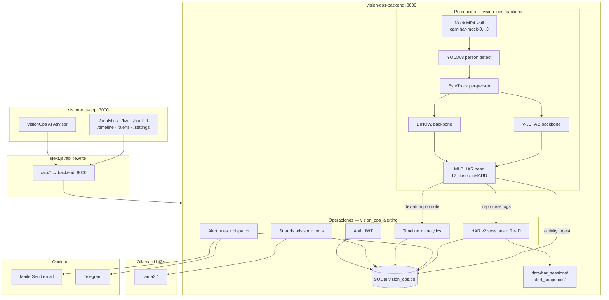
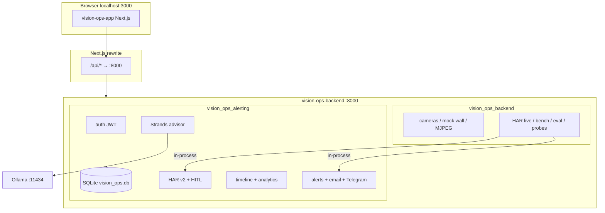
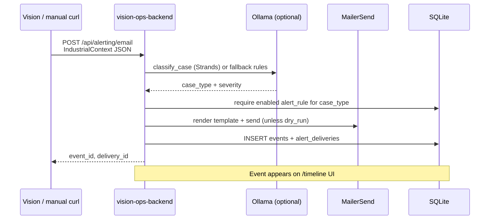
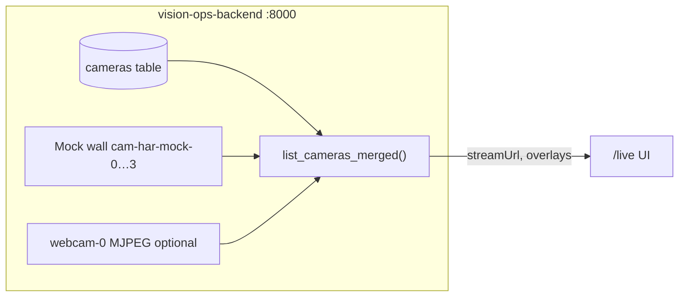
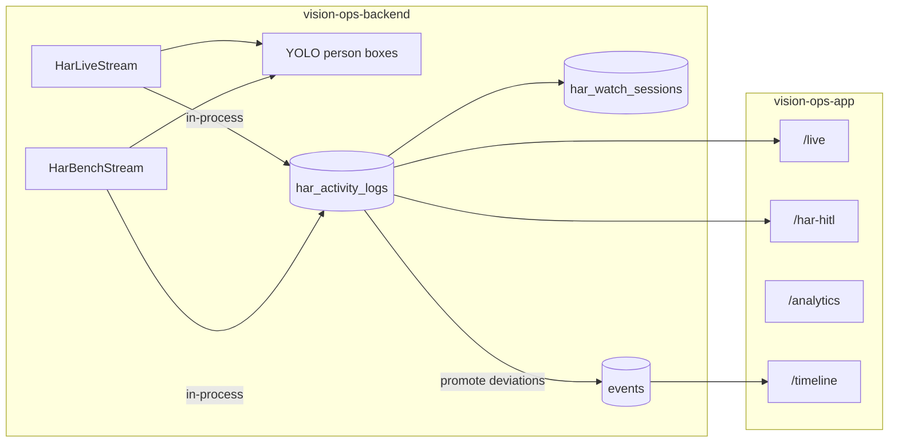
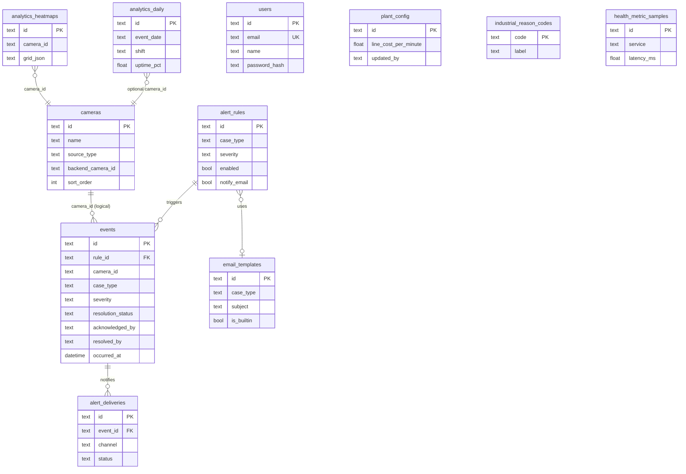

# AI Co-Pilot para el Piso de Producción: Ver, Guiar, Mejorar

> **VisionOps** — Sistema de inteligencia visual para un **Gemelo Digital de Planta** que convierte cámaras IP (RTSP/ONVIF) en comprensión operativa en tiempo real, asistiendo a supervisores sin sustituirlos.

**Titular / Divulgante:** Alignity IQ Edge, LLC — Houston, Texas, EUA  
**Equipo #56 (MNA-V · Tec de Monterrey, Campus Estado de México):** Landy Haydee Schlebach Osorio · Carlos Pano Hernández · Carlos Fernando Del Castillo Rey  
**Asesor académico:** Dr. Gerardo Camacho  
**Patrocinador industrial:** Dr. José Jacobo Eluani Vázquez (Representante Legal, Alignity IQ Edge, LLC)

**Documentos de referencia (repositorio):**

| Documento | Contenido |
|-----------|-----------|
| `Avance 1. Analisis exploratorio de datos/Main_ AI CoPilot Ver Guiar Mejorar (1).pptx.pdf` | Problema industrial, pilares Ver·Guiar·Mejorar, alcance del prototipo |
| `Avance 1. Analisis exploratorio de datos/Enterprise_AI_Project_Launch.pptx.pdf` | Presentación de lanzamiento del proyecto Enterprise AI |
| `Avance 1. Analisis exploratorio de datos/NDA_VisionOps_AlignityIQEdge_FirmadoXLandy.pdf` | Marco legal, definición formal de VisionOps y activos protegidos |
| [`Paper/main.tex`](Paper/main.tex) | **Manuscrito académico IMRaD** (LaTeX): pipeline per-person HAR, EDA InHARD, resultados piloto |

---

## Contexto del problema

En muchas fábricas **no se sabe realmente qué ocurre en el piso de producción** — solo se ven resultados al final del turno o del mes. La supervisión depende de recorridos físicos, monitores pasivos o reportes manuales. Eso genera:

- **Errores humanos y variabilidad** entre operadores y turnos  
- **Falta de visibilidad en tiempo real** sobre acciones, inactividad y desvíos de proceso  
- **Retraso entre el evento y la acción correctiva** (minutos u horas, no segundos)  
- **Capacitación reactiva** en lugar de guía contextual en el momento

El problema **no es la falta de datos** — hay cámaras, sensores y registros — sino la **interpretación mientras ocurre**. Esto impacta directamente productividad, calidad, seguridad y entrenamiento, y es parte del camino hacia **fábricas inteligentes (Industria 4.0)**.

La propuesta de Alignity IQ Edge es un **copiloto de IA** que observa, entiende y ayuda a mejorar la operación: no solo monitoreo pasivo, sino colaboración humano–IA en el piso.

---

## Visión del proyecto: VisionOps

**VisionOps** es el nombre formal del sistema (Acuerdo de Confidencialidad, 2026): un sistema de **inteligencia visual basado en IA** que procesa flujos de video en tiempo real para crear un **Gemelo Digital de Planta** — una representación digital dinámica del entorno industrial derivada de múltiples streams simultáneos.

### Objetivo estratégico

Construir un entorno donde humanos e IA colaboran en la operación diaria:

| Dimensión | Capacidad | Resultado esperado |
|-----------|-----------|-------------------|
| **Reconocimiento** | Detectar acciones, identificar errores, monitorear procesos | Saber *qué* está pasando, *dónde* y *cuándo* |
| **Guía** | Acompañar al operador, validar pasos, sugerir correcciones | Intervenir antes de que el desvío escale |
| **Optimización** | Analizar tiempos y movimientos, detectar ineficiencias | Mejorar productividad con evidencia visual |

Estos tres ejes se materializan en el lema del proyecto: **Ver · Guiar · Mejorar**.

### Alcance del prototipo (marco académico)

El objetivo del proyecto integrador **no es un sistema industrial completo**, sino un **prototipo funcional** que valide el concepto en un horizonte acotado (~3 meses):

1. **Definir un caso real** de manufactura o logística (acciones operativas, zonas, desvíos típicos)  
2. **Aprovechar modelos pre-entrenados** de visión por computadora (fundacionales + HAR) en lugar de entrenar desde cero  
3. **Desarrollar lógica de decisión** — reglas, clasificación de casos, alertas y validación de pasos  
4. **Entregar un demo integrado** — ingestión de video, inferencia, bitácora, dashboard y asesor IA

**Fuentes de datos previstas:** datasets abiertos con video etiquetado (p. ej. **InHARD**), clips simulados o capturados durante el proyecto, y datos generados por el equipo en `har-research/`.

### Activos del ecosistema VisionOps (marco NDA)

El acuerdo de confidencialidad define cuatro familias de activos que este repositorio desarrolla o prototipa:

| Familia | Ejemplos en el repo |
|---------|---------------------|
| **Activos de visión** | Streams MJPEG/RTSP, heatmaps DINO, timelines semánticos, bitácora visual |
| **Activos de IA** | YOLOv8 (personas), DeepSORT (tracking), DINOv2/V-JEPA 2 (HAR y anomalías), embeddings SFace, orquestación Strands + Ollama |
| **Activos de infraestructura** | Servicio FastAPI unificado (`vision-ops-backend`), ingestión multi-stream, despliegue local/edge vía `run-local.sh` |
| **Activos de negocio** | Bitácora Visual Automatizada, alertas de cuellos de botella, KPIs (OEE, CoQ, Pareto), detección de montacargas/operador inactivo, workflow ack/resolve |

> **Confidencialidad:** el código, modelos fine-tuned, datasets curados y metodologías derivadas son propiedad de Alignity IQ Edge, LLC. Uso académico bajo NDA; no replicar la Bitácora Visual ni publicar activos protegidos sin aprobación escrita.

---

## Resumen ejecutivo

Este repositorio contiene **dos capas complementarias**:

1. **Investigación ML** — pipeline unificado en `har-research/` (00–08), checkpoints HAR, código DINOv3/V-JEPA en `models/`  
2. **Demo VisionOps integrado** — dos procesos ejecutables (API unificada + frontend) que simulan el flujo productivo end-to-end

| Pilar | Qué resuelve en planta | Implementación en el demo |
|-------|------------------------|---------------------------|
| **Ver** | Ingesta multi-cámara y comprensión de escena/acción | Mock MP4 wall + **2 modelos HAR v2** (V-JEPA 2 / DINOv2) en loop live, YOLO + ByteTrack per-person, probes batch en `/live` |
| **Guiar** | Alertas en baja latencia y acompañamiento operativo | Reglas SQLite, clasificador Strands/Ollama, email/Telegram, promoción de desvíos HAR a Timeline, chat por cámara |
| **Mejorar** | Bitácora visual, KPIs post-turno, mejora continua | Timeline (ack → resolve), dashboard OEE/CoQ/Pareto, Person HITL, **VisionOps AI Advisor**, métricas de modelos en `/analytics` |

**Stack actual (2026):** autenticación JWT, dashboard unificado `/analytics`, live HAR + model probes en `/live`, Person HITL en `/har-hitl`, advisor flotante Strands + Ollama, SQLite único en `vision-ops-backend/data/`, **dos procesos** (`run-local.sh` → `:8000` + `:3000`).

---

## Panorama del demo (dos procesos)

El demo ejecutable une **API unificada** (percepción + operaciones) y **experiencia de supervisor** (frontend). Vision y ops comparten el mismo proceso FastAPI en `:8000`.

### vision-ops-backend — API unificada (`:8000`)

**Responsabilidad:** percepción visual *y* orquestación operativa en un solo servicio.

| Capa | Módulos | Tecnología |
|------|---------|------------|
| **Visión** | Cámaras MJPEG/mock, SFace, probes DINO/V-JEPA, HAR live/bench/eval, YOLO | OpenCV, PyTorch, FastAPI streaming |
| **Operaciones** | SQLite, auth JWT, alert rules, timeline, analytics, HAR v2 HITL, advisor Strands | SQLAlchemy, Strands + Ollama, MailerSend |

HAR live escribe logs y sesiones **in-process** (sin HTTP entre servicios). La bitácora, KPIs y reglas viven en `vision-ops-backend/data/vision_ops.db`.

### vision-ops-app — Experiencia del supervisor (`:3000`)

**Responsabilidad:** dashboard unificado para Ver, Guiar y Mejorar.

| Ruta | Pilar | Descripción |
|------|-------|-------------|
| `/analytics` | Mejorar | **Dashboard** — OEE, CoQ, HAR plant 360°, AI model metrics, inference logs |
| `/timeline` | Mejorar | Bitácora — filtros, ack/resolve, resumen IA |
| `/alerts` | Guiar | CRUD reglas, plantillas email, prueba dispatch |
| `/settings` | Mejorar | Variables de planta, fórmulas KPI |
| `/live` | Ver | Grid multi-cámara, overlays HAR, batch model probes, bench, chat por cámara |
| `/har-hitl` | Mejorar | HITL — cola de revisión, registry de personas, sesiones |
| `/login` | — | Autenticación email/contraseña |

**Proxy:** el browser llama `/api/*` → backend `:8000` (`next.config.ts`), evitando CORS en desarrollo.

**Asesor flotante:** `VisionOpsAdvisor` en todas las páginas del dashboard.

### Roadmap: prototipo → producción

El demo actual **simula** capacidades que VisionOps desplegará en planta real (según NDA y presentación del patrocinador):

| Capacidad demo | Estado actual | Target industrial |
|----------------|---------------|-------------------|
| Ingesta de video | Webcam + MP4 mock | RTSP/ONVIF multi-cámara en edge (Mini-PC/NUC) |
| HAR / acciones | 2 modelos fine-tuned InHARD (`har-research`) | Modelos calibrados por línea/cliente Alignity |
| Alertas | Email MailerSend + reglas SQLite | SMS, andon, integración MES/ERP |
| Asesor IA | Ollama local + Strands | VLM (Gemini Vision / GPT-4V) + contexto operativo |
| Gemelo digital | Dashboard + timeline + KPIs | Representación 3D/espacial de zonas y flujos |
| Privacidad | SFace opt-in, datos locales | Políticas por sitio, retención configurable |

---

## VisionOps demo stack (for developers & AI agents)

The runnable demo consists of **two processes** started together via `./run-local.sh`:

| Service | Directory | Port | Role |
|---------|-----------|------|------|
| **vision-ops-backend** | `vision-ops-backend/` | **8000** | Unified API — vision (cameras, HAR, probes, faces) + ops (SQLite, alerts, timeline, auth, advisor) |
| **vision-ops-app** | `vision-ops-app/` | **3000** | Next.js 16 dashboard |

### Arquitectura completa de IA (VisionOps)



**Flujo per-person HAR (live):** frame mock → YOLO bbox → crop top-down → ventana temporal (32 frames) → embedding congelado V-JEPA2 o DINOv2 → cabezal MLP → acción + confianza + top-k → overlay MJPEG + fila SQLite + artefactos de sesión (crops, tracks).

**Flujo Guiar:** desvío HAR o contexto industrial → `classify_case` (Strands/Ollama o reglas) → regla habilitada por `case_type` → plantilla email → `events` + `alert_deliveries` → UI Timeline.

**Flujo Mejorar:** supervisor en `/har-hitl` corrige tracks → registry de personas → métricas en `/analytics` → advisor con snapshot operativo.

### System architecture (deployment)



### Alert pipeline (email → timeline)



### Live camera data flow



Camera **metadata** lives in SQLite; **runtime** streams and probe artifacts are merged in-process on `GET /api/cameras`.

### HAR integral logging (live mock videos)



**Three HAR models (`har-research`)** — trained on 12 InHARD industrial action classes:

| ID | Architecture | Accuracy | Mock camera |
|----|--------------|----------|-------------|
| `v2-vjepa-powermean7` | **V-JEPA2 PowerMean-7** — 7-MLP ensemble + Power Mean q=0.5 (`checkpoints/powermean7/`) | **87.8% ★ Best** | `cam-har-03` |
| `v2-vjepa` | V-JEPA 2 + MLP (`har_vjepa_12c_topdown_allavail`) | 78.5% | `cam-har-01` |
| `v2-dinov2` | DINOv2 + MLP (`har_dinov2_12c_topdown_allavail`) | — | `cam-har-02` |

> PowerMean-7 includes **"No action"** and **"Assemble system"** classes for idle detection.
> Checkpoints: `har-research/checkpoints/powermean7/` (7 × .pt, ~17 MB total).

| Env (`VISIONOPS_*` in backend `.env`) | Default | Role |
|---------------------------------------|---------|------|
| `VISIONOPS_DRY_RUN` | `true` | No real MailerSend |
| `VISIONOPS_HAR_EMAIL_ENABLED` | `false` | Never email on HAR events |
| `VISIONOPS_HAR_PROMOTE_NON_ASSEMBLY` | `true` | Timeline events when label ≠ Assemble system |
| `VISIONOPS_HAR_LOW_CONFIDENCE_THRESHOLD` | `0.15` | Promote low-confidence predictions |
| `VISIONOPS_HAR_LOG_RETENTION_DAYS` | `7` | Prune old log rows |
| `VISIONOPS_HAR_SESSION_ARTIFACTS_DIR` | `data/har_sessions/` | HITL crops + embeddings |

| Env (backend, unprefixed) | Default | Role |
|---------------------------|---------|------|
| `HAR_ACTIVITY_INGEST_ENABLED` | `true` | Write live/probe rows to SQLite |
| `HAR_LIVE_ENABLED` | `true` | Loop mock MP4s with sliding-window HAR |
| `HAR_V2_SESSION_ENABLED` | `true` | Full session audit (crops, tracks) |

### Python environments

| Directory | Tool | Purpose |
|-----------|------|---------|
| Repository root | `pyproject.toml` + `uv sync --all-groups` | har-research notebooks |
| `vision-ops-backend/` | `uv sync --extra har` (+ `--extra mcp` for MCP server) | Unified FastAPI API |
| `vision-ops-app/` | `npm install` | Next.js frontend |

---

## Repository structure

```text
.
├── run-local.sh                 # Backend :8000 + frontend :3000 + Ollama
├── Avance 1. Analisis exploratorio de datos/   # PDFs académicos
├── vision-ops-backend/          # FastAPI unificado — visión + ops (:8000)
│   ├── src/vision_ops_backend/  # cameras, faces, vision, HAR inference
│   ├── src/vision_ops_alerting/ # auth, alerts, timeline, analytics, HAR v2 HITL, advisor
│   ├── mcp/db_context_server.py # Optional MCP — SQLite ops context for Cursor
│   └── data/                    # gitignored — vision_ops.db, har_sessions, alert_snapshots
├── vision-ops-app/              # Next.js 16 + React 19 + Tailwind 4 (:3000)
│   ├── app/(dashboard)/         # analytics, timeline, alerts, live, har-hitl, …
│   ├── lib/api.ts               # Unified fetch helpers + JWT headers
│   └── next.config.ts           # /api/* → :8000 rewrite
├── har-research/                # ML pipeline (00–08), lib/, checkpoints, data/
├── scripts/                     # Legacy Phase 0 notebooks (not used by demo)
├── Paper/                       # Manuscrito IMRaD (LaTeX)
├── outputs/                     # gitignored — scripts/ + research artifacts
├── pyproject.toml               # Root Python deps (har-research)
└── README.md
```

---

## Prerequisites

| Tool | Version | Used by |
|------|---------|---------|
| **Python** | 3.11–3.12 | Unified FastAPI backend (`requires-python >=3.11,<3.13`) |
| **[uv](https://docs.astral.sh/uv/)** | latest | Python dependency management |
| **Node.js + npm** | 20+ recommended | `vision-ops-app` |
| **macOS camera access** | — | Webcam stream + face enrollment (Terminal/IDE permission) |
| **Ollama** | [ollama.com](https://ollama.com/download) | **Required** for VisionOps AI Advisor + alert classifier (Strands); `./run-local.sh` starts `ollama serve` if installed |
| **Internet** (first run) | — | Face ONNX download (~40 MB), npm packages |

### One-time setup

```bash
# Install uv
curl -LsSf https://astral.sh/uv/install.sh | sh

git clone <url-del-repositorio>
cd AI-Co-Pilot-for-the-Production-Floor-See-Guide-Improve

# Root research environment (har-research, optional)
uv sync --all-groups

# Face models (optional — only if WEBCAM_ENABLED + FACE_ENABLED)
./models/install_face_models.sh

# Env files (run-local.sh copies from .example if missing)
cp vision-ops-app/.env.local.example vision-ops-app/.env.local
cp vision-ops-backend/.env.example vision-ops-backend/.env
```

---

## Quick start (all services)

From the **repository root**:

```bash
./run-local.sh
```

This script:

1. Ensures face ONNX models exist when webcam is enabled
2. Runs `uv sync --extra har` in backend
3. Runs `npm install` in frontend if needed
4. **Ollama (Advisor LLM):** starts or uses existing Ollama with `llama3.1`
5. Frees ports 8000 and 3000
6. Starts backend + frontend (webcam off by default; set `WEBCAM_ENABLED=true` for live camera)

Skip automatic Ollama install/pull: `OLLAMA_AUTO_INSTALL=false OLLAMA_AUTO_PULL=false ./run-local.sh`

| URL | Page |
|-----|------|
| http://localhost:3000/login | Sign in / create account (required before dashboard) |
| http://localhost:3000/analytics | **Default home** — OEE, CoQ, Pareto, heatmap, KPI tooltips, rendimiento HAR |
| http://localhost:3000/timeline | Post-shift log — ack / resolve workflow, filtros HAR |
| http://localhost:3000/alerts | Alert rules + email templates CRUD |
| http://localhost:3000/settings | Plant cost variables + KPI formula reference |
| http://localhost:3000/live | Multi-cámara — streams HAR live, batch model probes, bench, chat por cámara |
| http://localhost:3000/har-hitl | Person HITL — sesiones, registro, cola de revisión |
| http://localhost:8000/health | Unified API liveness |
| http://localhost:8000/docs | OpenAPI (vision + ops) |

**Default login** (seeded on first start when `users` is empty): `admin@visionops.local` / `admin123`

**VisionOps AI Advisor:** blue floating button (bottom-right) on every dashboard page — context-aware chat powered by Strands + Ollama.

### Run services individually

```bash
# Backend only
cd vision-ops-backend && uv sync --extra har
uv run uvicorn vision_ops_backend.main:app --reload --host 0.0.0.0 --port 8000

# Frontend only
cd vision-ops-app && npm install && npm run dev
```

---

## Environment variables

### vision-ops-app (`vision-ops-app/.env.local`)

| Variable | Default | Purpose |
|----------|---------|---------|
| `NEXT_PUBLIC_API_URL` | `http://localhost:8000` | Backend URL for SSR; browser uses `/api/*` rewrite |

Browser calls use the proxy in `next.config.ts`: `/api/*` → backend `:8000`.

### vision-ops-backend (`vision-ops-backend/.env`)

**Vision / HAR** (unprefixed):

| Variable | Default | Purpose |
|----------|---------|---------|
| `WEBCAM_ENABLED` | `false` | Open MacBook camera on startup |
| `CAMERA_INDEX` | `0` | Webcam device index |
| `CORS_ORIGINS` | `http://localhost:3000,...` | Must include your UI origin |
| `PUBLIC_API_BASE` | `http://localhost:8000` | Absolute stream URLs in JSON |
| `HAR_ENABLED` | `true` | Include cam-har-01…02 mock cameras |
| `HAR_CHECKPOINT_DIR` | `har-research/checkpoints` | Trained `.pt` weights |
| `HAR_LIVE_ENABLED` | `true` | Sliding-window HAR on mock MP4s |
| `HAR_V2_SESSION_ENABLED` | `true` | Full session audit (HITL artifacts) |
| `HAR_ACTIVITY_INGEST_ENABLED` | `true` | Write HAR rows to SQLite in-process |

**Ops** (`VISIONOPS_*` prefix — see `.env.example`):

| Variable | Default | Purpose |
|----------|---------|---------|
| `VISIONOPS_DRY_RUN` | `true` | Safe default — no real email unless `false` |
| `VISIONOPS_MAILERSEND_API_TOKEN` | — | Required for real sends |
| `VISIONOPS_FROM_EMAIL` / `VISIONOPS_TO_EMAIL` | — | Sender + recipients |
| `VISIONOPS_OLLAMA_MODEL` | `llama3.1` | Strands classifier + advisor |
| `VISIONOPS_AUTH_SECRET` | dev default | JWT signing — **change in production** |
| `VISIONOPS_SEED_ADMIN_EMAIL` | `admin@visionops.local` | First-user seed |
| `VISIONOPS_SEED_ADMIN_PASSWORD` | `admin123` | Default admin password (dev only) |
| `VISIONOPS_SEED_DB` | `false` | Legacy flag — demo timeline seed is disabled; data comes from live HAR |
| `VISIONOPS_DATABASE_URL` | `sqlite:///.../data/vision_ops.db` | SQLite path |
| `VISIONOPS_HAR_SESSION_ARTIFACTS_DIR` | `data/har_sessions/` | HITL crops + embeddings |

### Root `.env` (optional — har-research only)

Not used by `./run-local.sh`. Copy from `.env.example` only if you run root notebook experiments.

| Variable | Purpose |
|----------|---------|
| `REDIS_URL` | Optional event buffer for notebook 04 (`redis://localhost:6379/0`) |

Demo auth uses `VISIONOPS_AUTH_SECRET` in `vision-ops-backend/.env`, not the root `.env`.

---

## Authentication

Simple **email + password** login (no OAuth). Implemented in **vision-ops-backend**; the Next.js app stores a JWT in `localStorage` and sends `Authorization: Bearer …` on mutating API calls.

| Item | Detail |
|------|--------|
| UI | `/login` — sign in or create account (name, email, password) |
| API | `POST /api/auth/login`, `POST /api/auth/register`, `GET /api/auth/me` |
| Storage | SQLite table `users` (`id`, `email`, `name`, `password_hash`, `created_at`) |
| Roles | **Not implemented** — all authenticated users share the same permissions |
| Attribution | User **display name** stored on `events.acknowledged_by`, `events.resolved_by`, `alert_rules.updated_by`, `plant_config.updated_by` |

Protected routes (require Bearer token): timeline ack/resolve, alert rule CRUD, email template CRUD, plant settings PATCH.

```bash
# Login (returns token + user)
curl -s -X POST http://localhost:8000/api/auth/login \
  -H 'Content-Type: application/json' \
  -d '{"email":"admin@visionops.local","password":"admin123"}' | jq .

# Use token on protected calls
TOKEN="<paste token>"
curl -s -X PATCH http://localhost:8000/api/timeline/evt-xxx/acknowledge \
  -H "Authorization: Bearer $TOKEN"
```

---

## VisionOps AI Advisor (chat bot)

Floating **ops advisor** on every dashboard page (`components/advisor/VisionOpsAdvisor.tsx`). Uses the same **Strands + Ollama** stack as alert classification, with tools that query live SQLite context (cameras, open events, rules, KPIs).

| Endpoint | Purpose |
|----------|---------|
| `GET /api/advisor/welcome?page=live` | Intro when chat opens (page-aware) |
| `POST /api/advisor/chat` | User message → advisor reply + snapshot |
| `GET /api/advisor/context` | Raw operational snapshot (debug / MCP parity) |

Requires **Ollama** with `VISIONOPS_OLLAMA_MODEL` (default `llama3.1`) for full replies; deterministic fallbacks exist for greetings.

### Optional MCP server (Cursor / agents)

`vision-ops-backend/mcp/db_context_server.py` exposes the same DB context over MCP stdio:

```bash
cd vision-ops-backend
uv sync --extra mcp
uv run python mcp/db_context_server.py
```

See file header for Cursor `mcpServers` JSON config.

---

## Database schema (vision-ops-backend)

**File:** `vision-ops-backend/data/vision_ops.db` (gitignored, WAL mode, auto-created on startup)

**Source of truth:** `vision-ops-backend/src/vision_ops_alerting/db/models.py`  
**Reference DDL:** `vision-ops-backend/docs/schema.sql`

### Entity relationship



### Tables summary

| Table | Purpose |
|-------|---------|
| `users` | App login accounts (bcrypt passwords) |
| `cameras` | Camera registry for Live UI; links to backend via `backend_camera_id` (e.g. `webcam-0`, `cam-01`) |
| `alert_rules` | Configurable rules on `/alerts`; one enabled rule per `case_type` required for email dispatch |
| `email_templates` | Built-in + cloned HTML email templates per case type |
| `events` | Timeline incidents — includes workflow: `resolution_status`, `acknowledged_by/at`, `resolved_by/at`, reason codes, downtime/scrap |
| `alert_deliveries` | Email send log linked to events |
| `industrial_reason_codes` | Close-out reason codes for timeline resolve modal |
| `plant_config` | Editable plant costs, shift hours, KPI floors/ceilings (Settings page) |
| `analytics_daily` | Shift KPI snapshots (OEE components, uptime, flow) |
| `analytics_heatmaps` | 10×10 grid JSON per camera/shift/date |
| `health_metric_samples` | Telemetry history (backend latency probes) |
| `har_activity_logs` | Log integral HAR por cámara (live + probe): acción, confianza, top-k, YOLO JSON |
| `har_watch_sessions` | Sesiones de observación HAR por cámara/video |
| `har_inference_runs` / `har_inference_results` | Historial de probes batch (`probe-all`) |

**DBeaver tip:** connect to the absolute path printed by `uv run python -c "from vision_ops_alerting.config import settings; print(settings.database_url)"`. Refresh schema (F5) after upgrades. While `run-local.sh` runs, SQLite uses WAL mode (`vision_ops.db-wal`).

### Startup seed behavior

On every startup (`init_db()`):

- Creates tables if missing (+ incremental SQLite migrations in `db/session.py`)
- Seeds **default admin user** if `users` is empty (`admin@visionops.local` / `admin123`)
- Seeds **default cameras** if `cameras` table is empty
- Ensures **built-in email templates** and **industrial reason codes**
- Ensures **default action rules** (one rule per case type) and **plant_config**
- Seeds **HAR mock cameras** (`cam-har-01`, `cam-har-02`) when missing
- Disables legacy industrial cameras (`cam-01`, `cam-02`, …)

No synthetic timeline or analytics rows are inserted — KPIs and heatmaps reflect real HAR activity or show empty states.

---

## API reference

Base URL: `http://localhost:8000` (or via frontend proxy `http://localhost:3000/api/...`).

Interactive OpenAPI: http://localhost:8000/docs

---

### vision-ops-backend (`:8000`)

#### Health

```bash
curl -s http://localhost:8000/health
# {"status":"ok"}
```

#### Cameras

```bash
# List webcam + industrial mocks (cam-har-01…02 when HAR_ENABLED)
curl -s http://localhost:8000/api/cameras | jq .

# MJPEG stream (open in browser or )
open "http://localhost:8000/api/cameras/webcam-0/stream"
```

#### Face enrollment (SFace + YuNet)

```bash
curl -s http://localhost:8000/api/faces/status | jq .

curl -s http://localhost:8000/api/faces/storage | jq .

# Enroll (webcam must be running)
curl -X POST http://localhost:8000/api/faces/enroll \
  -H 'Content-Type: application/json' \
  -d '{"name":"Carlos"}'

# Remove enrollment
curl -X DELETE http://localhost:8000/api/faces/enroll
```

#### Vision probes (optional — legacy industrial cameras disabled by default)

DINO/V-JEPA scene probes remain in the API for experimentation. Live demo uses HAR on the mock wall instead.

```bash
curl -s http://localhost:8000/api/vision/status | jq .
curl -X POST http://localhost:8000/api/vision/probe \
  -H 'Content-Type: application/json' \
  -d '{"camera_id":"cam-01","mode":"auto"}'
```

| Method | Path | Description |
|--------|------|-------------|
| GET | `/health` | Liveness |
| GET | `/api/cameras` | Camera list with `streamUrl`, overlays |
| GET | `/api/cameras/{id}/stream` | MJPEG multipart (webcam-0 only) |
| GET | `/api/faces/status` | Enrollment state |
| GET | `/api/faces/storage` | Paths + privacy explanation |
| GET | `/api/faces/preview` | Enrollment preview JPEG |
| POST | `/api/faces/enroll` | Capture samples → embedding |
| DELETE | `/api/faces/enroll` | Remove enrollment |
| GET | `/api/vision/status` | Probe state for cam-01, cam-02 |
| GET | `/api/vision/har/status` | HAR probe state (two har-research models) |
| POST | `/api/vision/har/probe-all` | Run all HAR classifiers on shared clip |
| GET | `/api/har/runs` | HAR probe batch history (alerting SQLite) |
| GET | `/api/har/results/latest` | Latest prediction per model |
| POST | `/api/har/activity` | Ingest live/probe activity log row(s) |
| GET | `/api/har/activity` | Paginated integral logs per camera |
| GET | `/api/har/analytics/daily` | Action mix, hourly counts, deviations |
| GET | `/api/har/analytics/realtime` | Last N minutes rollup |
| POST | `/api/advisor/camera-chat` | Per-camera HAR chat (Live feeds) |
| GET | `/api/notifications/recent` | Recent events incl. HAR deviations |
| GET | `/api/vision/storage` | Artifact paths |
| POST | `/api/vision/probe` | Run DINO or V-JEPA probe |
| GET | `/api/vision/artifacts/{id}/overlay` | Heatmap overlay image |
| GET | `/api/vision/artifacts/{id}/still` | Cached still frame |
| GET | `/api/vision/artifacts/{id}/preview` | Probe preview |
| GET | `/api/vision/cameras/{id}/last` | Last probe JSON |

---

### Ops API (`:8000`)

#### Auth

```bash
curl -s -X POST http://localhost:8000/api/auth/login \
  -H 'Content-Type: application/json' \
  -d '{"email":"admin@visionops.local","password":"admin123"}' | jq .

curl -s http://localhost:8000/api/auth/me \
  -H "Authorization: Bearer $TOKEN" | jq .
```

#### Health & telemetry

```bash
curl -s http://localhost:8000/health
# {"status":"ok","service":"vision-ops-backend",...}

curl -s http://localhost:8000/api/telemetry | jq .
curl -s http://localhost:8000/api/notifications/email/status | jq .
```

#### Cameras (SQLite + backend merge)

```bash
curl -s "http://localhost:8000/api/cameras" | jq .
curl -s "http://localhost:8000/api/cameras?status=live&zone=Assembly" | jq .
curl -s http://localhost:8000/api/cameras/stats/live | jq .

curl -X POST http://localhost:8000/api/cameras \
  -H 'Content-Type: application/json' \
  -d '{
    "name": "Dock Camera 3",
    "location": "Loading Dock",
    "zone": "Zone B",
    "sourceType": "rtsp",
    "streamUrl": "rtsp://example/stream",
    "inferenceModel": "yolov8",
    "backendCameraId": "cam-02"
  }'

curl -X DELETE http://localhost:8000/api/cameras/cam-xxxxxxxxxxxx
```

#### Alert rules

```bash
curl -s http://localhost:8000/api/alerts/actions | jq .
curl -s http://localhost:8000/api/alerts/rules | jq .

curl -X POST http://localhost:8000/api/alerts/rules \
  -H "Authorization: Bearer $TOKEN" \
  -H 'Content-Type: application/json' \
  -d '{
    "icon": "schedule",
    "title": "Idle operator Line 4",
    "description": "Alert when idle > 5 min",
    "zone": "LINE 4",
    "caseType": "user_not_working",
    "severity": "WARNING",
    "enabled": true,
    "notifyEmail": true
  }'

curl -X POST http://localhost:8000/api/alerts/rules/rule-xxxxxxxxxxxx/toggle
curl -X PATCH http://localhost:8000/api/alerts/rules/rule-xxxxxxxxxxxx \
  -H 'Content-Type: application/json' \
  -d '{"severity":"CRITICAL"}'
curl -X DELETE http://localhost:8000/api/alerts/rules/rule-xxxxxxxxxxxx

curl -s http://localhost:8000/api/alerts/deliveries | jq .
```

**Case types:** `user_not_working` · `user_left_position` · `forklift_in_zone` · `unknown`

#### Email dispatch (creates timeline event)

```bash
# Full pipeline: classify → rule check → email (or dry-run) → persist event
curl -X POST http://localhost:8000/api/alerting/email \
  -H 'Content-Type: application/json' \
  -d '{
    "site_id": "site-01",
    "line_id": "line-a",
    "camera_id": "cam-01",
    "timestamp": "2026-05-26T20:00:00Z",
    "actor": {"type": "operator", "track_id": "12", "name": "Operator 12"},
    "evidence": {"idle_seconds": 900}
  }'

# Test templates (uses built-in test contexts)
curl -X POST http://localhost:8000/api/alerting/email/test/user_not_working
curl -X POST http://localhost:8000/api/alerting/email/test/forklift_in_zone
```

**IndustrialContext schema** (`schemas.py`):

```json
{
  "site_id": "string",
  "line_id": "string",
  "camera_id": "string",
  "timestamp": "ISO-8601",
  "actor": { "type": "operator|forklift|unknown", "track_id": "?", "name": "?" },
  "evidence": { "idle_seconds": 900, "roi": "zone-id", "bbox": [0,0,1,1] },
  "links": { "live_url": "...", "timeline_url": "..." },
  "case_type": "optional override",
  "severity": "optional override"
}
```

#### Timeline (workflow)

```bash
curl -s "http://localhost:8000/api/timeline?limit=20" | jq .
curl -s "http://localhost:8000/api/timeline?severity=critical&resolutionStatus=OPEN" | jq .
curl -s http://localhost:8000/api/timeline/summary | jq .
curl -s http://localhost:8000/api/timeline/stats | jq .
curl -s http://localhost:8000/api/timeline/reason-codes | jq .

# Requires Authorization header (logged-in user name recorded on event)
curl -X PATCH http://localhost:8000/api/timeline/evt-xxxxxxxxxxxx/acknowledge \
  -H "Authorization: Bearer $TOKEN"

curl -X PATCH http://localhost:8000/api/timeline/evt-xxxxxxxxxxxx/resolve \
  -H "Authorization: Bearer $TOKEN" \
  -H 'Content-Type: application/json' \
  -d '{"status":"RESOLVED","reasonCode":"OPERATOR_IDLE","downtimeSeconds":120,"notes":"Retrained"}'
```

**Resolution statuses:** `OPEN` → `ACKNOWLEDGED` → `RESOLVED` | `FALSE_POSITIVE`

#### Analytics (industrial KPIs)

```bash
curl -s "http://localhost:8000/api/analytics/summary?shift=morning" | jq .
curl -s "http://localhost:8000/api/analytics/oee?shift=morning" | jq .
curl -s "http://localhost:8000/api/analytics/coq?shift=morning" | jq .
curl -s "http://localhost:8000/api/analytics/pareto?shift=morning" | jq .
curl -s "http://localhost:8000/api/analytics/heatmap?shift=morning&cameraId=cam-01" | jq .
curl -s "http://localhost:8000/api/analytics/insights?shift=morning" | jq .
```

KPI formulas read from `plant_config` (editable on `/settings`). UI shows ⓘ tooltips via `GET /api/settings/kpi-definitions`.

#### Plant settings

```bash
curl -s http://localhost:8000/api/settings/plant | jq .
curl -s http://localhost:8000/api/settings/kpi-definitions | jq .

curl -X PATCH http://localhost:8000/api/settings/plant \
  -H "Authorization: Bearer $TOKEN" \
  -H 'Content-Type: application/json' \
  -d '{"lineCostPerMinute":130,"siteName":"Plant A"}'
```

#### VisionOps AI Advisor

```bash
curl -s "http://localhost:8000/api/advisor/welcome?page=timeline" | jq .

curl -X POST http://localhost:8000/api/advisor/chat \
  -H 'Content-Type: application/json' \
  -d '{"message":"Any open critical incidents?","page":"timeline","pageTitle":"Post-Shift Log"}' | jq .
```

#### Email templates

```bash
curl -s http://localhost:8000/api/alerts/email-templates | jq .
curl -X POST http://localhost:8000/api/alerts/email-templates/tmpl-xxx/preview | jq .
```

---

## Frontend map (`vision-ops-app`)

| Route | Component | Primary API (`lib/api.ts`) |
|-------|-----------|----------------------------|
| `/login` | `LoginPageClient` | `loginUser`, `registerUser` |
| `/analytics` | `AnalyticsPageClient` | **Default home** — OEE, CoQ, Pareto, insights, heatmap, HAR rollups + model performance |
| `/timeline` | `TimelinePageClient` | `fetchTimelineEvents`, ack/resolve, `fetchShiftSummary`, export PDF |
| `/alerts` | `AlertsPageClient` | `fetchAlertRules`, CRUD, email templates, `sendTestAlertEmail` |
| `/settings` | `SettingsPageClient` | `fetchPlantSettings`, `updatePlantSettings`, KPI definitions |
| `/live` | `LivePageClient` | Streams merged, HAR overlays, bench, model probes, `CameraHarChat`, playback sync |
| `/har-hitl` | `HarPersonHitlPageClient` | HAR v2 sessions, person registry, review queue (`lib/har-v2-api.ts`) |
| *(all dashboard)* | `VisionOpsAdvisor` | `fetchAdvisorWelcome`, `advisorChat` |
| *(TopNav)* | `NotificationsBell` | Open `OPEN` events count + link to timeline |

**Auth:** `(dashboard)/layout.tsx` wraps pages in `AuthProvider`; JWT in `localStorage` via `lib/auth.ts`.

**Important files for agents:**

| File | Why |
|------|-----|
| `vision-ops-app/lib/api.ts` | All HTTP client functions + proxy + JWT headers |
| `vision-ops-app/lib/auth.ts` | Token storage |
| `vision-ops-app/components/advisor/VisionOpsAdvisor.tsx` | AI chat bot UI |
| `vision-ops-app/next.config.ts` | API rewrites |
| `vision-ops-app/AGENTS.md` | Next.js 16 breaking changes — read before editing UI |
| `vision-ops-backend/src/vision_ops_alerting/db/models.py` | DB schema |
| `vision-ops-backend/src/vision_ops_alerting/agent.py` | Alert classification + email |
| `vision-ops-backend/src/vision_ops_alerting/advisor_agent.py` | Floor advisor chat |
| `vision-ops-backend/src/vision_ops_alerting/services/event_workflow.py` | Timeline ack/resolve |
| `vision-ops-backend/src/vision_ops_alerting/services/industrial_analytics.py` | OEE / CoQ / Pareto |
| `vision-ops-backend/src/vision_ops_backend/main.py` | Backend lifespan (webcam) |

---

## Gitignored / local-only assets

| Path | Contents |
|------|----------|
| `models/face_detection_yunet/*.onnx` | YuNet face detector (~1 MB) |
| `models/face_recognition_sface/*.onnx` | SFace recognizer (~40 MB total download) |
| `vision-ops-backend/data/faces/` | `owner.npz`, enrollment preview |
| `vision-ops-backend/data/vision/` | DINO heatmaps, V-JEPA probe JSON |
| `vision-ops-backend/data/` | SQLite `vision_ops.db` (+ WAL sidecars) |
| `vision-ops-app/.env.local` | Local env |
| `vision-ops-backend/.env` | MailerSend token, auth secret, recipients |

---

## Troubleshooting

| Symptom | Fix |
|---------|-----|
| **401 on ack/resolve/settings** | Sign in at `/login`; mutating APIs require `Authorization: Bearer` |
| **Advisor LLM DOWN on /alerts** | Use **Ollama.app**: `brew uninstall ollama 2>/dev/null; brew install --cask ollama && open -a Ollama && ollama pull llama3.1` — do **not** use `brew install ollama` (formula lacks `llama-server`) |
| **ERROR: llama-server binary not found** | Same fix — reinstall with `brew install --cask ollama`, then restart `./run-local.sh` |
| **Advisor chat shows ERROR:** | Same as above; check chip on http://localhost:3000/alerts |
| **503 on webcam stream** | Grant camera permission to Terminal/IDE; close other apps using the camera |
| **Black Live tile** | Start backend before refreshing; check `GET /api/cameras` |
| **CORS errors** | Add your UI origin to `CORS_ORIGINS` (backend) and `VISIONOPS_CORS_ORIGINS` |
| **Email not sending** | Set `VISIONOPS_DRY_RUN=false` + valid `VISIONOPS_MAILERSEND_API_TOKEN`; check `/api/notifications/email/status` |
| **403 on email dispatch** | Enable a matching `alert_rule` for the classified `case_type` |
| **Empty timeline** | Trigger a HAR deviation on `/live`, send test alert from `/alerts`, or POST `/api/alerting/email` |
| **`users` table missing in DBeaver** | Refresh connection (F5); use absolute DB path from `VISIONOPS_DATABASE_URL` |
| **Classification always fallback** | Start Ollama with `llama3.1` or pass explicit `case_type` in payload |
| **Port in use** | `./run-local.sh` kills processes on 8000/3000; or set `BACKEND_PORT`, `VISIONOPS_PORT`, `FRONTEND_PORT` |

---

## For AI coding agents

When starting a new session on this repo:

1. **Read this README** for architecture, ports, and API contracts.
2. **Run `./run-local.sh`** to validate the full stack (requires uv + npm + camera on Mac).
3. **Pick the right service:**
   - UI changes → `vision-ops-app/` (read `AGENTS.md` first — Next.js 16 differs from training data)
   - Webcam / vision / face → `vision-ops-backend/`
   - Rules / timeline / email / DB / auth / advisor → `vision-ops-backend/`
4. **Auth:** login API + `users` table in backend SQLite; frontend JWT in `lib/auth.ts`. No RBAC yet.
5. **Camera changes:** Update `cameras` table and backend HAR/mock config; Live page reads merged data from `GET /api/cameras`.
6. **New alert case types:** Add to `schemas.py` CaseType, `templates.py`, `alert_actions.py`, seed rules, and frontend types in `lib/api.ts`.
7. **KPI changes:** Edit `plant_config` + `services/industrial_analytics.py`; expose defs in `services/plant_settings.py` KPI_DEFINITIONS.
8. **Do not commit** `.env`, `.env.local`, SQLite DB, face embeddings, or API tokens.

Sub-project READMEs: `vision-ops-backend/README.md`, `vision-ops-app/README.md`, `har-research/README.md`.

---

## Research stack (root `pyproject.toml`)

La capa de investigación alimenta los modelos que el demo consume en runtime. Flujo: **EDA → embeddings V-JEPA2/DINOv2 (YOLO top-down crops) → MLP/GRU → eval per-person → HITL → análisis (06) → session review (08) → manuscrito LaTeX en `Paper/`**.

### HAR research pipeline (`har-research/`)

| Notebook | Función | Salida principal |
|----------|---------|------------------|
| `00_Pipeline_Run_All.ipynb` | Orquestador completo | embeddings, checkpoints, eval |
| `01_Data_and_Strategy.ipynb` | Estrategia de datos | `pipeline_step01_summary.json` |
| `02_Embedding_Extraction.ipynb` | V-JEPA2 + DINOv2 (top-down crop) | `embeddings.npz` |
| `03_Train_HAR_Head.ipynb` | MLP sobre embeddings | `checkpoints/har_*_12c_topdown_allavail.pt` |
| `04_Analysis_and_Visualization.ipynb` | UMAP, métricas, strips | `outputs/har_analysis/` |
| `05_Mock_Video_Eval.ipynb` | Eval en videos mock | session logs + preview frames |
| `08_Session_Log_Review.ipynb` | Auditoría HITL + Re-ID | session review artifacts |

**Configuración activa:** 12 clases · top-down YOLO crops · all-available clips · checkpoints `har_vjepa_12c_topdown_allavail` / `har_dinov2_12c_topdown_allavail`.

**Legacy (no usar):** `notebooks/`, `scripts/` Fase 0, carpeta top-level `vision-ops-alerting/` — superseded por `har-research/` + backend unificado.

### Componentes y datos

| Componente | Location | Role |
|-----------|----------|------|
| **InHARD** | HD externo / `har-research/data/` | 5303 clips, 14 meta-acciones industriales |
| **DINOv3** | HuggingFace | Representaciones espaciales SSL — heatmaps |
| **V-JEPA 2.x** | HuggingFace (`facebook/vjepa2-vitl-fpc64-256`) | Embeddings temporales HAR |
| **Checkpoints HAR** | `har-research/checkpoints/` | Cabezales MLP entrenados (`.pt` + `.json`) |
| **Paper LaTeX** | `Paper/` | Manuscrito IMRaD con figuras desde `har-research/outputs/` |
| **YOLOv8 / ByteTrack** | `har-research/lib/` | Detección y tracking per-person |
| **Strands + Ollama** | `vision-ops-backend/` | Clasificador de casos de alerta + VisionOps AI Advisor |
| **MailerSend** | `vision-ops-backend/` | Email transaccional de alertas industriales |

Los pesos (`.pt`, `.onnx`, `.pth`) están excluidos de git. Los probes de visión en backend usan torch/transformers cuando están instalados (`uv sync --extra har` en backend).

```bash
uv sync --all-groups          # full research deps
uv sync --group research     # Jupyter only
cd vision-ops-backend && uv sync --extra har   # HAR live inference deps
```

---

## Licencia

Privado — © Alignity IQ Edge, LLC. Todos los derechos reservados. El código de terceros bajo `models/` conserva sus licencias originales.
