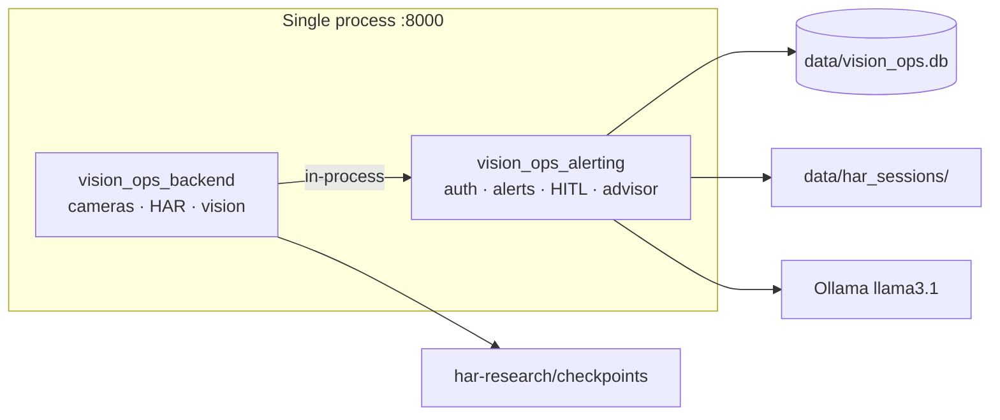

# vision-ops-backend

Unified FastAPI service for **VisionOps** — perception (HAR, cameras, optional faces) and operations (SQLite, auth, alerts, timeline, analytics, HITL, Strands advisor) on **port 8000**.

## Architecture



Entry point: `vision_ops_backend.main:app` — registers all routers from both packages.

## Quick start

**Full stack (recommended):** from repo root:

```bash
./run-local.sh
```

**Backend only:**

```bash
cd vision-ops-backend
uv sync --extra har
cp .env.example .env
uv run uvicorn vision_ops_backend.main:app --reload --host 0.0.0.0 --port 8000
```

## Packages

| Package | Role |
|---------|------|
| `vision_ops_backend` | Mock wall, MJPEG webcam, HAR live/bench/eval, optional SFace |
| `vision_ops_alerting` | Auth, alerts, timeline, analytics, HAR v2 HITL, advisor (in-process) |

## Data (gitignored)

| Path | Content |
|------|---------|
| `data/vision_ops.db` | SQLite — users, rules, events, HAR logs |
| `data/har_sessions/` | HITL crops, embeddings, session JSON |
| `data/alert_snapshots/` | Alert snapshot JPEGs |
| `data/faces/` | Optional SFace enrollment |
| `data/vision/` | Legacy DINO/V-JEPA probe artifacts |

## HAR live pipeline

1. Mock MP4 from `vision-ops-app/public/mock-videos/` (4-slot wall)
2. YOLOv8 person detection → ByteTrack (`HAR_LIVE_PER_PERSON_MODE=true`)
3. Top-down crop → sliding window → frozen V-JEPA2 or DINOv2 → MLP head
4. MJPEG overlay + SQLite ingest + optional session audit (`HAR_V2_SESSION_ENABLED`)

Checkpoints: `har-research/checkpoints/har_vjepa_12c_topdown_allavail`, `har_dinov2_12c_topdown_allavail`

```bash
uv sync --extra har
curl -X POST http://localhost:8000/api/vision/har/probe-all
```

## Key endpoints

| Area | Examples |
|------|----------|
| Health | `GET /health` |
| Cameras | `GET /api/cameras` |
| HAR live | `GET /api/vision/har/live/{cameraId}`, bench under `/api/vision/har/bench/` |
| HAR v2 HITL | `GET /api/har/v2/sessions`, `/persons`, `/review-queue` |
| Auth | `POST /api/auth/login` |
| Alerts | `GET /api/alerts/rules`, `POST /api/alerting/email` |
| Timeline | `GET /api/timeline`, `PATCH /api/timeline/{id}/acknowledge` |
| Analytics | `GET /api/analytics/oee`, `/coq`, `/pareto`, `/heatmap` |
| Advisor | `POST /api/advisor/chat`, `POST /api/advisor/camera-chat` |

OpenAPI: http://localhost:8000/docs

## Config

- **Vision / HAR:** unprefixed (`WEBCAM_ENABLED`, `HAR_*`) — see `.env.example`
- **Ops:** `VISIONOPS_*` (auth, email, SQLite, HAR ops flags)

Frontend: `NEXT_PUBLIC_API_URL=http://localhost:8000` in `vision-ops-app/.env.local`; browser uses `/api/*` rewrite.

## MCP (optional)

```bash
uv sync --extra mcp
uv run python mcp/db_context_server.py
```

## Troubleshooting

- **503 on webcam stream:** macOS camera permission or device in use.
- **HAR models not ready:** train via `har-research/` or copy `.pt` + `.json` into `har-research/checkpoints/`.
- **Fresh DB issues:** delete `data/vision_ops.db*` and restart.
- **CORS:** add UI origin to `CORS_ORIGINS`.
